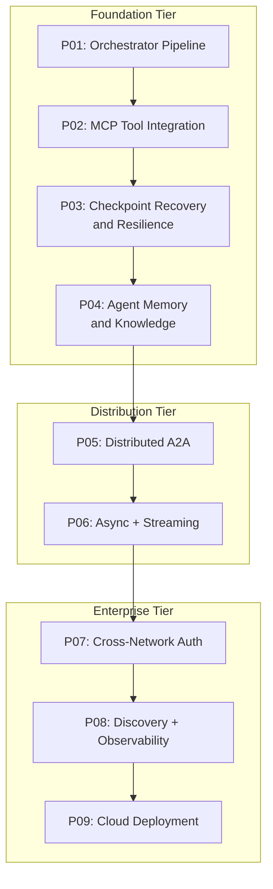
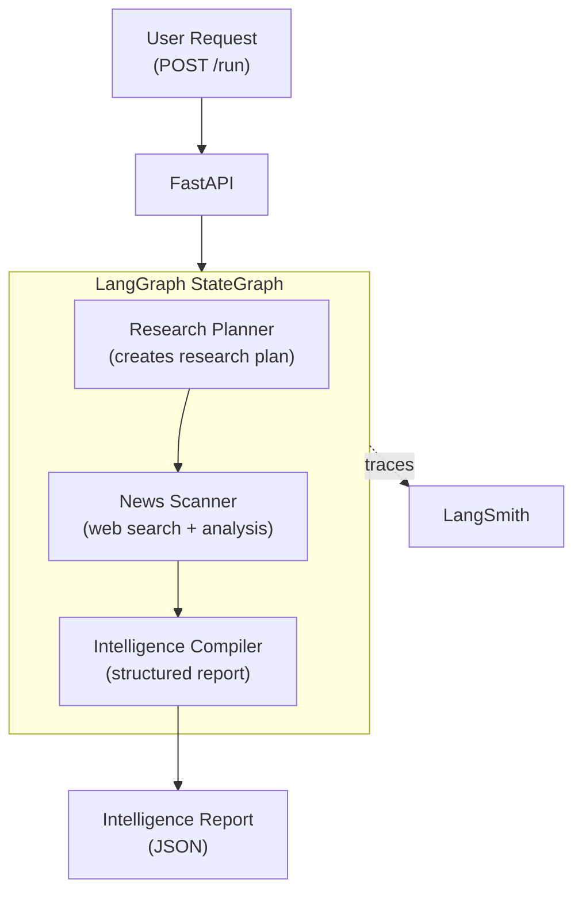
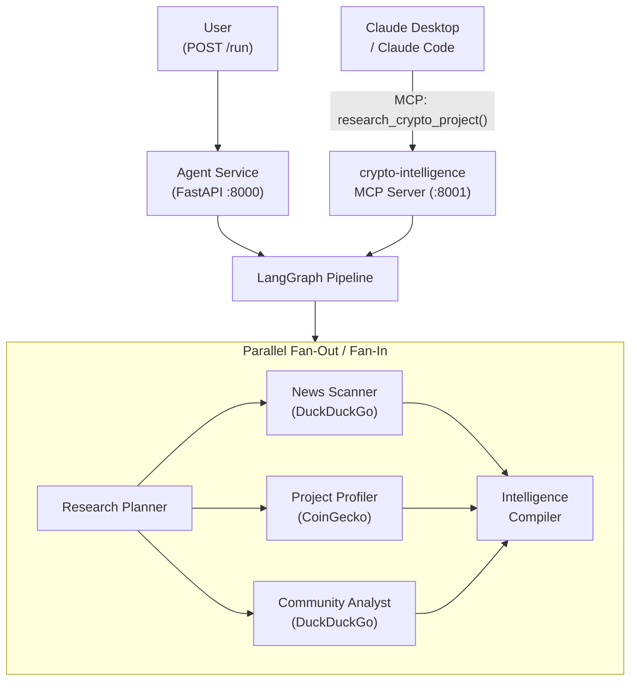
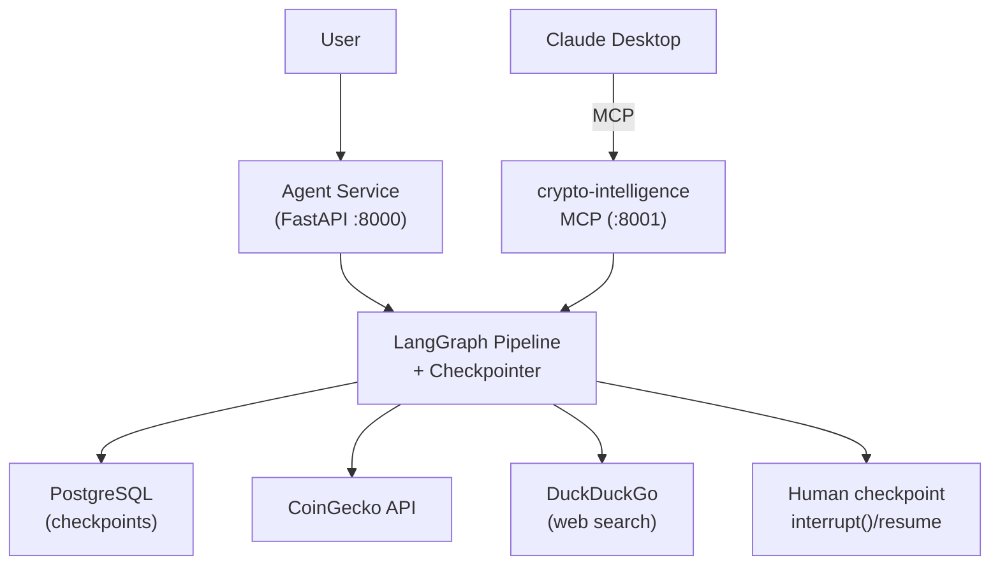
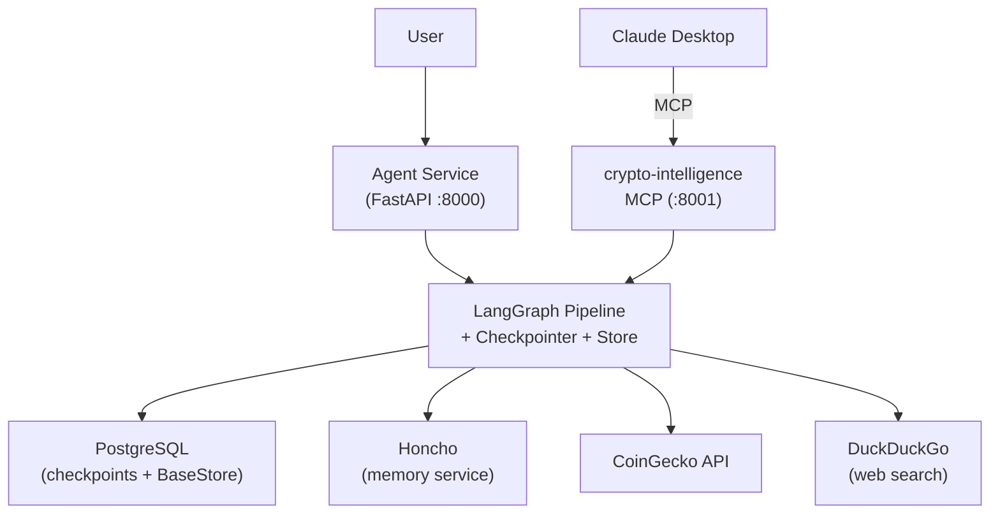
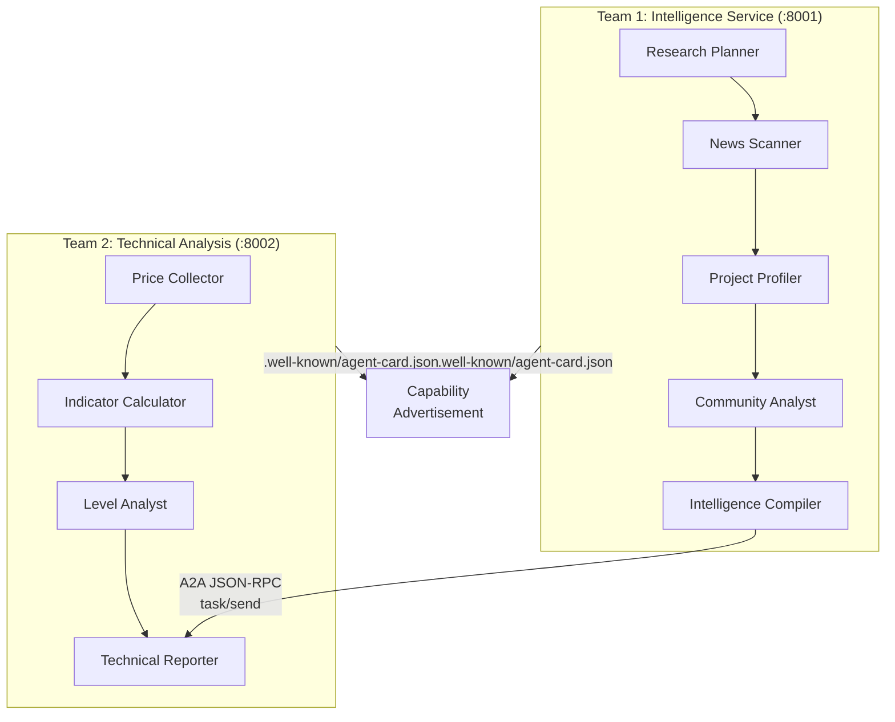
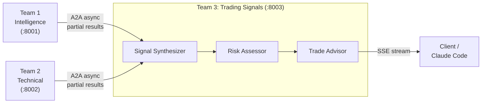
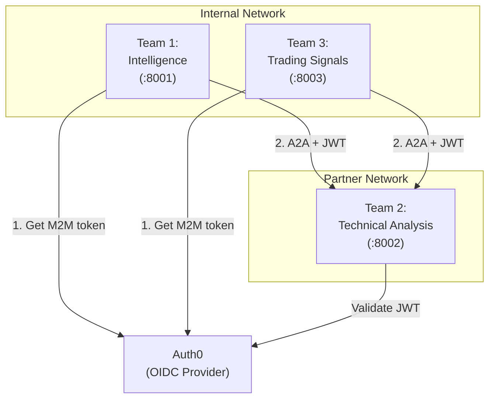

# Agent Design Patterns -- Curriculum

A progressive, hands-on curriculum that takes you from a single LangGraph pipeline to a fully distributed, authenticated, cloud-deployed multi-agent system. Every pattern builds on the previous one, with working code, Docker Compose for local execution, LangSmith tracing, and verbose debug output.

## Domain: Crypto Intelligence Platform

All patterns share a single compelling domain -- **crypto project intelligence**. Three specialized teams emerge as complexity grows:

### Team 1: Intelligence (Fundamentals Research)

Built in Patterns 01-04. Focuses on non-technical, qualitative signals.

| Agent | Responsibility | Introduced |
|-------|---------------|------------|
| Research Planner | Analyzes the crypto project request, creates a structured research plan | P01 |
| News Scanner | Searches the web for recent news, announcements, partnerships | P01 |
| Project Profiler | Researches project goals, whitepaper, technology, roadmap, team/founders | P02 |
| Community Analyst | Monitors X/Twitter sentiment, community discussions, GitHub activity | P02 |
| Intelligence Compiler | Synthesizes all findings into a structured fundamentals report | P01 |
| Project Verifier | Validates CoinGecko matches and detects ambiguous project names | P03 |
| Project Selector | Pauses for human clarification when multiple coin matches exist | P03 |

### Team 2: Technical Analysis

Introduced in Pattern 05. Focuses on price-based, quantitative analysis.

| Agent | Responsibility |
|-------|---------------|
| Price Collector | Gets current and historical price/volume data via MCP (CoinGecko) |
| Indicator Calculator | Computes technical indicators (MA, RSI, MACD, Bollinger Bands) |
| Level Analyst | Identifies support/resistance levels, key price zones |
| Technical Reporter | Produces a technical analysis summary |

### Team 3: Trading Signals

Introduced in Pattern 06. Consumes output from both Team 1 and Team 2.

| Agent | Responsibility |
|-------|---------------|
| Signal Synthesizer | Combines fundamentals intelligence + technical analysis |
| Risk Assessor | Evaluates risk (volatility, market conditions, project health) |
| Trade Advisor | Produces actionable buy/sell/hold recommendations with confidence levels |

---

## Pattern Progression

**Main path**: P01 -> P02 -> P03 -> P04 -> P05 -> P06 -> P07 -> P08 -> P09

**Team introduction timeline**:

- Patterns 01-04: Team 1 only (single service, growing capabilities)
- Pattern 05: Team 2 arrives (2 services, A2A communication)
- Pattern 06+: Team 3 arrives (3 services, full distributed system)

---

## Foundation Tier (Patterns 01-04)

Focus: agent internals -- orchestration, tools, memory. All run in a single Docker network with no authentication overhead.

---

### Pattern 01: Orchestrator Pipeline

**Folder:** `examples/01-orchestrator-pipeline/`

**Goal:** Decompose a complex research task across multiple specialized agents within a single LangGraph StateGraph, exposed via FastAPI, with LangSmith tracing and verbose debug output.

**What it solves:** A single monolithic Agent (one graph with 3 nodes) tries to plan, research, and write all at once, producing shallow results. The orchestrator pattern splits responsibility across focused agents that each do one thing well.

**Team focus:** Team 1 (Intelligence) -- first 3 agents as a minimal viable pipeline.

**Agents:**

| Agent | Role | Tool |
|-------|------|------|
| Research Planner | Breaks down "Research project X" into subtasks | None (LLM only) |
| News Scanner | Searches the web for recent news and project info | DuckDuckGo web search |
| Intelligence Compiler | Synthesizes findings into a structured report | None (LLM only) |

**Architecture:**

**Key concepts:**

- LangGraph StateGraph with TypedDict state
- Orchestrator pattern (single graph coordinates multiple agent nodes)
- Simple tool use (DuckDuckGo web search as a direct tool call)
- LangSmith tracing setup and trace inspection
- Verbose mode for learning/debugging
- Docker Compose single-container deployment
- FastAPI as a simple trigger endpoint (Software 2.0 entry point)

**Use case example:** "Research the Arbitrum crypto project" -- plan the research, scan the web for news and project info, compile into a structured intelligence report.

**Prerequisites:** Python 3.14+, Docker, uv, API keys (Azure OpenAI or Anthropic), LangSmith account

---

### Pattern 02: MCP Tool Integration

**Folder:** `examples/02-mcp-tool-integration/`

**Goal:** Expose the agent pipeline as an MCP server so any AI client can use it. Build a `crypto-intelligence` MCP server that wraps the full 5-agent research pipeline as a single `research_crypto_project` tool. Claude Desktop, Cursor, or Claude Code calls one MCP tool and gets a complete intelligence report -- the internal orchestration is hidden.

**What it solves:** In Pattern 01, the pipeline is locked behind `POST /run` -- a REST endpoint that only custom HTTP clients can call. Claude Desktop can't access your agent's research capability. MCP solves this: you expose the agent's **capability** (not raw API wrappers) as an MCP tool, and any MCP-compatible client discovers and uses it through a standard protocol.

**Team focus:** Team 1 (Intelligence) -- expands to full 5-agent lineup with two entry points: REST (`POST /run`) and MCP (`research_crypto_project` tool).

**Agents:**

| Agent | Role | Data Source |
|-------|------|-------------|
| Research Planner | Extracts project identifiers, generates tailored search queries | None (LLM only) |
| News Scanner | Web search for news, partnerships, announcements | DuckDuckGo (direct) |
| Project Profiler | Market data, developer stats, project fundamentals | CoinGecko API (direct httpx, retry with backoff) |
| Community Analyst | Social sentiment from Reddit, X/Twitter | DuckDuckGo (site-restricted queries) |
| Intelligence Compiler | Synthesizes all outputs into structured report | None (LLM only) |

**Architecture:**

**Key concepts:**

- Expose agent capability via MCP, not raw API wrappers (outcome-oriented tools)
- MCP server with `FastMCP` wrapping the full LangGraph pipeline as one tool
- Two entry points to the same graph: REST (`POST /run`) and MCP (`research_crypto_project`)
- Parallel fan-out/fan-in: planner → [news | profiler | community] → compiler (LangGraph native `add_edge` fan-out)
- Data source ownership: each research node owns exactly one external source (no duplication)
- LLM-driven query generation: planner extracts `project_name`/`coin_ticker` and generates `NEWS_QUERIES`/`COMMUNITY_QUERIES` for downstream nodes
- Software 3.0 principle: the "UI" is Claude Desktop, not a bespoke chat widget
- Multi-container Docker Compose (agent REST service + MCP server)
- Claude Desktop / Claude Code / Cursor integration via MCP config

**Builds on:** Pattern 01

---

### Pattern 03: Checkpoint Recovery and Resilience

**Folder:** `examples/03-checkpoint-recovery/`

**Goal:** Add durable execution to the Pattern 02 pipeline using LangGraph's PostgreSQL-backed checkpointer. When a long-running research run fails midway, the system resumes from the last successful checkpoint instead of starting over.

**What it solves:** Pattern 02 already has a realistic failure surface: three external API calls, multiple LLM invocations, and a fan-out/fan-in graph. If `project_profiler` times out after `news_scanner` and `community_analyst` succeed, you currently lose completed work and repay the token and latency cost on retry. Checkpointing fixes resiliency, not memory.

**Team focus:** Team 1 (Intelligence) -- expands to 7 graph nodes: the 5 research agents plus Project Verifier and Project Selector for CoinGecko disambiguation and human-in-the-loop checkpoints.

**Architecture:**

**Key concepts:**

- LangGraph `PostgresSaver` for durable checkpoints
- Stable `thread_id` as the resume handle for a research workflow
- Resume-after-failure semantics: retry only the failed node, not the full graph
- Human-in-the-loop with `interrupt()` and `Command(resume=...)`
- Idempotent node design and graceful degradation around external API failures
- Docker Compose with PostgreSQL as durable workflow state

**libs/common additions:** `agent_common.persistence` -- PostgreSQL pool and checkpointer helpers

**Builds on:** Pattern 02

---

### Pattern 04: Agent Memory and Knowledge

**Folder:** `examples/04-agent-memory/`

**Goal:** Add actual cross-session memory using LangGraph `PostgresStore` plus a memory layer such as Honcho for richer user and project understanding. The system should remember which coins a user tracks, what they care about, and what was learned in previous research threads.

**What it solves:** Pattern 03 makes the workflow resilient, but it is still amnesiac. A resumed thread is not the same thing as long-term memory. Users expect the agent to remember repeated interests ("I keep tracking Arbitrum and Base"), preferences ("focus on developer traction"), and prior research findings across separate sessions.

**Team focus:** Team 1 (Intelligence) -- same 5 agents, now augmented with episodic and semantic memory.

**Architecture:**

**Key concepts:**

- `PostgresStore` / `BaseStore` for cross-thread memory
- User memory namespaces such as tracked coins, watchlists, and research preferences
- Project memory namespaces such as prior summaries, open risks, and last-reviewed timestamps
- Incremental research: query planning informed by previous findings
- Honcho as a production-oriented memory service for agent and user representations
- Memory freshness policies: separate stable facts from volatile market data

**Builds on:** Pattern 03

---

## Distribution Tier (Patterns 05-07)

Focus: splitting agents into separate services, introducing real distributed systems concerns. Each new team creates a genuine architectural challenge.

---

### Pattern 05: Distributed Agents -- A2A Protocol

**Folder:** `examples/05-distributed-a2a/`

**Goal:** Split agents across separate Docker containers -- simulating separate teams in an organization -- and communicate via the A2A (Agent-to-Agent) protocol.

**What it solves:** In a real company, different teams build and deploy their agents independently. Team 1 (Intelligence) cannot import Team 2's code directly. They need a standardized protocol for task handoff: "Here's a crypto project name, give me a technical analysis." A2A provides this.

**Story:** Team 2 (Technical Analysis) has built their own agent service with price data and indicator calculations. Team 1 needs to request technical analysis to enrich intelligence reports. The teams deploy independently and communicate via A2A.

**Architecture:**

**Key concepts:**

- A2A (Agent-to-Agent) protocol: JSON-RPC over HTTP
- Agent Cards (`.well-known/agent-card.json`) for capability advertisement
- Task lifecycle: `submitted` -> `working` -> `completed`
- Separate FastAPI services per team (independent deployment)
- Docker Compose with multiple services on the same network
- Protocol-driven endpoints replace REST API design

**libs/common additions:** `agent_common.a2a` -- A2A protocol client/server helpers

**Builds on:** Pattern 04

---

### Pattern 06: Async Communication and Streaming

**Folder:** `examples/06-async-streaming/`

**Goal:** Enable non-blocking agent communication and stream partial results as they become available.

**What it solves:** Team 3 (Trading Signals) needs data from BOTH Team 1 and Team 2. Calling them sequentially takes 60+ seconds. Team 3 must fire parallel async requests and stream partial signals as data arrives. Synchronous A2A calls from Pattern 05 become a bottleneck.

**Story:** Team 3 (Trading Signals) arrives. It fires parallel A2A requests to Team 1 and Team 2, merges results as they arrive, and streams buy/sell signals via SSE to the caller.

**Architecture:**

**Key concepts:**

- Async task submission (fire-and-poll vs. fire-and-wait)
- SSE (Server-Sent Events) for streaming partial results
- Parallel A2A requests: Team 3 calls Team 1 and Team 2 concurrently
- A2A async extensions (task status polling, push notifications)
- Non-blocking agent handoffs
- Backpressure and timeout patterns

**Builds on:** Pattern 05

---

### Pattern 07: Cross-Network Authentication

**Folder:** `examples/07-cross-network-auth/`

**Goal:** Secure agent-to-agent communication when agents operate in different trust zones, using Auth0 as a shared OIDC provider.

**What it solves:** Team 2 (Technical Analysis) is now operated by an external partner company. They run on a separate network with no implicit trust. Every A2A request must carry a JWT token. Without authentication, any service on the network could impersonate Team 1 and exfiltrate data from Team 2.

**Story:** Team 2 moves to a partner organization. Teams 1 and 3 must authenticate every A2A call with JWT tokens issued by Auth0. Team 2 validates tokens before processing any task.

**Architecture:**

**Key concepts:**

- Separate Docker networks simulating different organizational boundaries
- Auth0 OIDC / OAuth 2.0 for M2M (machine-to-machine) authentication
- JWT token flow: request -> attach to A2A call -> validate on receiver
- FastAPI JWT validation middleware
- Per-team client credentials
- Token caching and refresh patterns
- Zero-trust agent communication

**libs/common additions:** `agent_common.auth` -- auth middleware and token client

**Builds on:** Pattern 06

---

## Enterprise Tier (Patterns 08-09)

Focus: production readiness -- discovery, observability, and cloud deployment.

---

### Pattern 08: Agent Discovery and Observability

**Folder:** `examples/08-discovery-observability/`

**Goal:** Enable agents to find each other dynamically in enterprise environments, and monitor the full distributed system with distributed tracing.

**What it solves:** With hardcoded URLs, adding a new agent capability requires code changes in every consumer. When Team 2 adds a "Whale Tracker" agent, Team 3 should discover and use it without redeployment. Meanwhile, with 12+ agents across 3 teams, debugging failures requires distributed tracing across A2A calls.

**Story:** Team 2 adds a Whale Tracker agent that monitors large wallet movements. Team 3 discovers it dynamically through the shared agent registry and starts using it for trading signals -- no code changes, no redeployment.

**Key concepts (Discovery):**

- Three discovery patterns compared:
  1. Static/explicit (hardcoded URLs -- simplest, least flexible)
  2. Shared registry service (central catalog -- most common in enterprise)
  3. A2A Agent Cards with network scanning (decentralized -- most resilient)
- Registry service implementation (FastAPI + PostgreSQL)
- Agent registration, deregistration, health checking
- Capability-based agent matching
- Versioning and deprecation patterns

**Key concepts (Observability):**

- LangSmith dashboard: traces, latency, error rates across all 3 teams
- OpenTelemetry integration for infrastructure metrics
- Distributed tracing: correlate traces across A2A calls
- Health check patterns for agent liveness/readiness

**Builds on:** Pattern 07

---

### Pattern 09: Cloud Deployment (Azure)

**Folder:** `examples/09-cloud-deployment/`

**Goal:** Deploy the full three-team distributed system to Azure using Infrastructure as Code with automated CI/CD.

**What it solves:** Docker Compose is great for local development, but production needs managed infrastructure: auto-scaling, secret management, centralized logging, health monitoring, and independent deployment pipelines per team.

**Story:** All three teams go to production. Each deploys independently as an Azure Container App. Teams 1 and 3 are internal (Azure Managed Identity for auth), Team 2 is the external partner (Auth0 remains for cross-org calls).

**Key concepts:**

- Azure Container Apps for agent hosting (one per team)
- Azure Bicep templates for Infrastructure as Code
- Azure Container Registry for container images
- Azure Key Vault for secrets (replaces `.env`)
- Azure Managed Identity for internal auth (Team 1 <-> Team 3)
- Auth0 for cross-organization auth (Teams 1/3 <-> Team 2)
- GitHub Actions CI/CD pipeline (separate workflows per team)
- Log Analytics for centralized logging
- Cost optimization: scale-to-zero, consumption plans

**Builds on:** Pattern 08

---

## Deliverables Per Pattern

1. Self-contained working code (`cd examples/NN-name && docker compose up --build` to run)
2. Comprehensive `README.md` in the pattern folder
3. Full test suite (`tests/unit/`, `tests/api/`, `tests/e2e/`)
4. CHANGELOG entry

---

## Tech Stack

- **Python 3.14+** with **uv** for package and Python version management
- **LangGraph** for agent orchestration (StateGraph with typed state)
- **FastAPI** for agent HTTP/protocol endpoints
- **Docker Compose** for local multi-container environments
- **LangSmith** for tracing and observability
- **MCP** for standardized tool access (Pattern 02+)
- **A2A** for agent-to-agent communication (Pattern 05+)
- **Auth0** for OIDC-based agent authentication (Pattern 07+)
- **Azure Container Apps** for cloud deployment (Pattern 09)
