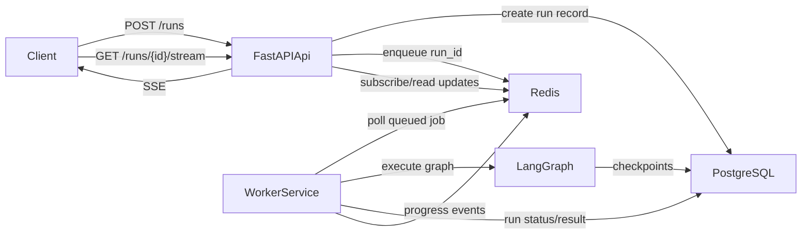

# Agent Server, Open-Source Alternatives, and Future Runtime Plan

## Executive Summary

This report captures the conclusions from the architectural review of:

- LangSmith Agent Server / LangSmith Deployments
- open-source alternatives for self-hosted agent runtimes
- the effort required to build a similar but narrower runtime for this repository

### Main conclusion

Do **not** replace the project's core `FastAPI + LangGraph` approach with LangSmith Agent Server.

Keep:

- `FastAPI` as the constant HTTP runtime across patterns
- `LangGraph` as the orchestration engine
- explicit infrastructure and protocol boundaries as part of the learning journey

Why:

1. LangSmith Agent Server requires a license and is not fully open source.
2. It hides exactly the internals that this curriculum is supposed to teach.
3. It does not align well with the later distributed patterns centered around A2A, independent services, discovery, and cross-network auth.

### Best future direction

For this repository, the strongest path is:

- keep the current `FastAPI + LangGraph` architecture
- add **PostgreSQL-backed LangGraph checkpointing** where persistence matters
- add **Redis-backed workers** only when the curriculum reaches async/background execution
- expose **SSE from FastAPI** when streaming becomes part of the story

The best open-source options are:

- **Aegra** as the closest OSS Agent Server alternative
- **Dramatiq + Redis** as the best lightweight worker/queue layer for this curriculum
- **Hatchet** or **Temporal** if a later pattern wants stronger durable workflow semantics

---

## Project Context

These conclusions are based on the current architectural intent described in:

- `docs/vision.md`
- `docs/curriculum.md`

The core principles in those documents matter:

- Pattern 01 starts with a familiar `POST /run` FastAPI endpoint.
- Pattern 02 moves to MCP.
- Pattern 05+ moves to A2A and separately deployed services.
- The curriculum is about **architectural knowledge**, not just shipping an agent behind a managed runtime.

That means any platform choice must be evaluated not only on convenience, but on whether it helps or hurts the teaching goals.

---

## What We Learned About LangSmith Agent Server

## What it provides

At first glance, LangSmith Agent Server looks like a strong enterprise runtime because it offers:

- task queue semantics
- persistent runs, threads, and assistants
- PostgreSQL-backed state
- Redis-backed signaling and streaming support
- SSE streaming
- background workers
- auth hooks
- deployment packaging around LangGraph

This makes it appealing for teams that want a productized runtime around LangGraph.

## The important limitations

### 1. Licensing and openness

This was the most important discovery.

- The core server runtime is not the same as the open-source `langgraph` library.
- The server/distribution layer is tied to LangSmith deployment products and licensing.
- Self-hosted deployment options require licensing and are not equivalent to a fully open-source stack.

This makes it a poor fit for a reference architecture project whose value comes from being inspectable, adaptable, and teachable end-to-end.

### 2. It hides the educational layers

The curriculum explicitly teaches:

- HTTP boundary design
- graph invocation patterns
- streaming design
- persistence and checkpointing
- service boundaries
- async/background work

Agent Server abstracts those away.

That is useful in a product, but not ideal in a design-pattern repository where the reader should understand the moving parts.

### 3. It is not the right model for later patterns

The curriculum after Pattern 03 becomes increasingly distributed:

- Pattern 05: A2A between separate services
- Pattern 06: async fan-out plus SSE
- Pattern 07: cross-network authentication
- Pattern 08: registry/discovery and observability
- Pattern 09: independent cloud deployment per team

Agent Server is much closer to a managed runtime for a LangGraph service than a framework for teaching explicit multi-service agent protocol design.

### 4. It introduces vendor coupling

Using Agent Server shifts the architecture toward:

- LangSmith deployment conventions
- LangGraph SDK-centric client patterns
- LangSmith-managed operational assumptions

That is acceptable for product teams who choose the platform deliberately, but less desirable for a curriculum whose goal is durable architectural understanding.

---

## Why FastAPI Should Remain the Mainline Architecture

The strongest decision remains:

- keep `FastAPI` as the public runtime boundary
- keep `LangGraph` as the execution model
- keep explicit infrastructure choices visible in the examples

### Why this matches the vision

From `docs/vision.md` and `docs/curriculum.md`, FastAPI is intentionally "the constant that evolves":

- Pattern 01: simple REST trigger
- Pattern 02: protocol exposure for MCP
- Pattern 05+: protocol-first A2A service boundary

This progression itself is one of the lessons.

Replacing that with a prebuilt agent runtime would weaken the narrative:

- fewer internals are visible
- fewer trade-offs are taught
- less of the "Software 2.0 to 3.0" transition is explicit

### Why this matches the codebase shape

The current repo already has a clean separation:

- thin FastAPI apps in `examples/*/src/app.py`
- graph wiring in `examples/*/src/agents/graph.py`
- shared utilities in `libs/common/src/agent_common/`

That means future runtime capabilities can be layered on incrementally without rewriting the core structure.

---

## Open-Source Alternatives

## 1. Aegra

### Summary

Aegra is the closest open-source alternative to LangSmith Deployments / Agent Server.

### Why it matters

- Apache 2.0 licensed
- self-hosted
- LangGraph-oriented
- PostgreSQL-backed
- supports streaming
- supports auth
- positioned explicitly as a LangSmith Deployments alternative

### Strengths

- most platform-like option without vendor lock-in
- keeps a familiar LangGraph SDK shape
- good if you want a self-hosted "agent server" style runtime quickly

### Weaknesses

- still abstracts internals away
- less aligned with the teaching goals than explicit FastAPI examples
- newer/smaller ecosystem than more established workflow tools

### Best use here

Treat Aegra as:

- a comparison point in documentation
- a possible optional appendix or future branch
- not the canonical runtime for the main curriculum

---

## 2. Dramatiq

### Summary

Dramatiq is the best lightweight open-source queue/worker layer for this repository if Redis-backed workers are needed.

### Why it matters

- simple mental model
- Redis broker support
- automatic retries with exponential backoff
- Python-friendly
- lower complexity than Celery

### Strengths

- easy to teach
- fits a `FastAPI + worker + Redis` Docker Compose story
- lets LangGraph remain the orchestrator while Dramatiq handles background execution

### Weaknesses

- not a full agent platform
- no built-in thread/run model like Agent Server
- no built-in SSE layer
- idempotency and run-state modeling remain the application's responsibility

### Best use here

Use Dramatiq when the curriculum first needs:

- jobs that outlive the HTTP request
- separate workers
- retries/backpressure
- a clean async/background execution story

This likely belongs around Pattern 06, not before.

---

## 3. Hatchet

### Summary

Hatchet is a durable workflow/task platform that is more structured than a raw Redis queue.

### Why it matters

- MIT licensed
- strong story around workers and durability
- self-hostable
- better workflow visibility than a plain queue

### Strengths

- useful if future patterns want durable long-running tasks
- more workflow-aware than Dramatiq
- good compromise between simple queueing and Temporal-scale complexity

### Weaknesses

- introduces a second orchestration model beside LangGraph
- can complicate the story if introduced too early
- stronger fit for advanced patterns than foundational ones

### Best use here

Consider Hatchet only if a future pattern wants to explicitly teach:

- durable long-running workflows
- replay/recovery semantics
- richer operational workflow visibility

---

## 4. Temporal

### Summary

Temporal is the strongest open-source workflow engine in this space.

### Why it matters

- durable execution
- task queues
- replay semantics
- strong retry model
- enterprise-scale operational patterns

### Strengths

- best option for serious durability and resilience
- excellent for long-running background workflows
- clear enterprise credibility

### Weaknesses

- high conceptual overhead
- introduces a separate orchestration paradigm
- operationally heavier than needed for the current curriculum

### Best use here

Temporal is appropriate only if the project later adds a pattern specifically about:

- durable workflow orchestration
- crash recovery and replay
- workflow-level execution history

It is too heavy for the mainline story at the current stage.

---

## 5. Procrastinate

### Summary

Procrastinate is a PostgreSQL-backed Python task queue.

### Why it matters

- can reduce infrastructure by removing Redis from the queue path
- async-friendly
- simpler operational footprint if PostgreSQL is already central

### Strengths

- one datastore story is attractive
- can be easier to explain than broker-heavy stacks

### Weaknesses

- less aligned with the explicit "Redis queues" direction being considered
- less of a classic queue architecture if Redis is part of the teaching goal

### Best use here

Keep as a simplification option, not the default plan.

---

## Recommended Ranking

For this repository, the practical ranking is:

1. **Keep FastAPI + LangGraph as the base architecture**
2. **Add Dramatiq + Redis when background workers are needed**
3. **Use Aegra as a documented OSS comparison/alternative**
4. **Consider Hatchet for a future advanced durability pattern**
5. **Consider Temporal only for a dedicated enterprise durability pattern**

---

## Recommended Future Runtime for This Repository

If the goal is to build a narrower, open-source, Agent-Server-like runtime inside this repo, the recommended stack is:

- `FastAPI` for the public API
- `LangGraph` for orchestration
- `PostgreSQL` for checkpoints and persistent run metadata
- `Redis` for queue dispatch and transient event delivery
- `Dramatiq` workers for background execution
- `SSE` from FastAPI for progress/result streaming

### Important design principle

Do **not** try to clone the whole LangSmith Agent Server product.

Instead, build the subset that is educationally useful:

- submit a background run
- execute it in a worker
- persist state
- stream updates to clients
- keep the moving parts understandable

### Proposed runtime shape

### Minimal API surface

The first useful version should expose:

- `POST /runs`
- `GET /runs/{run_id}`
- `GET /runs/{run_id}/stream`
- `POST /runs/{run_id}/cancel` (optional later)

### Data responsibilities

Use PostgreSQL for:

- LangGraph checkpoints
- run metadata
- final result
- run lifecycle state

Use Redis for:

- dispatching jobs to workers
- transient progress events
- optional SSE fan-out support

Do not use Redis as the only source of truth for run results.

---

## Effort Estimate

## 1. Proof of concept

Scope:

- one API service
- one worker service
- Redis queue
- PostgreSQL checkpoints
- simple run table/state model
- basic SSE progress

Estimated effort:

- **3 to 5 working days**

Why it is feasible:

- current apps are already thin
- graph construction is already isolated
- Docker Compose is already used in the repo

---

## 2. Course-quality implementation

Scope:

- robust run lifecycle
- retries and error handling
- idempotency rules
- reconnect-safe SSE behavior
- good tests across unit/api/e2e
- clear README and diagrams

Estimated effort:

- **7 to 12 working days**

This is the realistic target for a polished pattern example.

---

## 3. Near-Agent-Server parity

Scope:

- assistants/versioning model
- richer thread lifecycle
- multiple stream modes
- richer auth/authorization
- cron jobs
- replay/debug-oriented features
- fuller operational API

Estimated effort:

- **4 to 8 weeks**, possibly longer

This is **not recommended** for this repository unless the project explicitly decides to create its own reusable runtime platform.

---

## Best Engineering Practices for the Proposed Stack

If this runtime is implemented later, the following standards should guide it:

### Architectural rules

- keep FastAPI thin
- keep business logic in LangGraph nodes and domain modules
- keep queue logic outside graph node implementations
- let workers call the same `build_graph()` used by the API

### Reliability rules

- persist run metadata in PostgreSQL
- make worker jobs idempotent
- use one clear run-state machine
- never rely on SSE as the durable system of record
- use retries deliberately, not blindly

### Redis rules

- use Redis for queueing and transient event transport
- choose Streams over Pub/Sub if replayability is required
- define consistent key naming
- set connection timeouts
- use connection pooling
- avoid blocking commands in production

### Observability rules

- keep LangSmith tracing enabled for graph execution
- log queue lifecycle transitions
- expose `/health` endpoints for both API and worker-facing services where appropriate
- surface worker failures in durable run status, not only logs

---

## Where This Fits in the Curriculum

This should **not** become Pattern `1.1` or replace Pattern 01.

### Best placement

The best natural point is around **Pattern 06**.

Reason:

- Pattern 06 is already about async communication and streaming.
- That is where background workers, queues, and SSE become conceptually justified.
- Introducing Redis workers earlier would add infrastructure before the student has felt the architectural pain.

### Curriculum guidance

- Pattern 01 should remain simple and synchronous.
- Pattern 02 should remain focused on MCP.
- Pattern 03 should focus on PostgreSQL checkpointing and memory.
- Pattern 06 is the right place to add a queue/worker runtime story.

---

## Final Recommendations

### Decision record

1. **Keep FastAPI as the core HTTP boundary across the curriculum.**
2. **Do not switch the main architecture to LangSmith Agent Server.**
3. **Document Aegra as the closest OSS Agent Server-style alternative.**
4. **Use Dramatiq + Redis + PostgreSQL as the most practical path if background workers are added later.**
5. **Introduce queue/workers only when the curriculum reaches the async/streaming problem naturally.**

### Recommended next action

When the project is ready to design Pattern 06 in detail, create a focused design note covering:

- run lifecycle schema
- Redis event model
- SSE API contract
- worker retry/idempotency policy
- Docker Compose topology

---

## External Sources

### LangChain / LangGraph / LangSmith

- [LangSmith Agent Server](https://docs.langchain.com/langsmith/agent-server)
- [LangSmith Application Structure](https://docs.langchain.com/langsmith/application-structure)
- [Standalone Agent Server Deployment](https://docs.langchain.com/langsmith/deploy-standalone-server)
- [Self-Hosted LangSmith Overview](https://docs.langchain.com/langsmith/self-hosted)
- [Agent Server Scaling Guide](https://docs.langchain.com/langsmith/agent-server-scale)
- [LangGraph Persistence](https://docs.langchain.com/oss/python/langgraph/persistence)
- [LangGraph Durable Execution](https://docs.langchain.com/oss/python/langgraph/durable-execution)

### Open-source alternatives

- [Aegra README](https://github.com/ibbybuilds/aegra/blob/main/README.md)
- [Aegra Documentation](https://docs.aegra.dev/)
- [Hatchet Documentation](https://docs.hatchet.run/)
- [Hatchet GitHub](https://github.com/hatchet-dev/hatchet)
- [Temporal Task Queues](https://docs.temporal.io/task-queue)
- [Temporal Self-Hosted Guide](https://docs.temporal.io/self-hosted-guide)
- [Dramatiq User Guide](https://dramatiq.io/guide.html)
- [Procrastinate Documentation](https://procrastinate.readthedocs.io/en/stable/)

---

## Short Memory Version

If revisiting this topic later, remember:

- Agent Server looked attractive, but licensing and abstraction depth make it a poor fit for the main curriculum.
- The project should continue teaching explicit architecture through `FastAPI + LangGraph`.
- The closest OSS "Agent Server" replacement is **Aegra**.
- The best practical worker layer for this repo is **Dramatiq + Redis**.
- The right time to introduce workers is when the curriculum naturally reaches async/background execution, most likely around **Pattern 06**.
