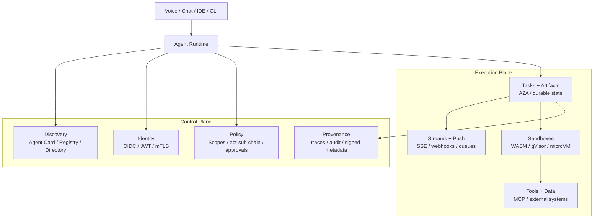

# Engineering Priorities for Distributed Agents

This report complements `docs/future_plans/agent-server-open-source-alternatives-report.md`.

That earlier report asked a runtime question: which stack should this repository build on?

This report asks the deeper question: **what engineering pieces actually matter if we want proper distributed agents, not just chat wrappers over services?**

It is grounded in:

- `docs/vision.md`
- `docs/curriculum.md`
- `docs/future_plans/agent-server-open-source-alternatives-report.md`
- recent research papers and surveys
- official protocol documentation
- engineering blogs from teams shipping agent infrastructure
- public demos and reference implementations

The central conclusion is simple:

> In Software 3.0, the primary abstraction is not the REST resource or the web UI. It is the **identity-bearing, capability-advertising, task-oriented agent runtime**.

HTTP still matters, but mostly as a transport. The durable design questions move upward:

- How do agents advertise capabilities?
- How do they discover and trust each other?
- How do they stream partial work and recover from failure?
- How do they act on behalf of users without becoming ambient-authority god processes?
- How do they execute risky tools without turning prompt injection into remote code execution?

If those pieces are missing, you do not yet have a production-grade distributed agent system. You have a demo.

## Executive Summary

The most important engineering pieces for distributed agents are:

1. **Protocol separation**: use different protocols for tool access, peer-agent collaboration, and event delivery.
2. **Durable task/state model**: treat long-running work, resumption, cancellation, and artifacts as first-class.
3. **First-class agent identity**: every agent, registry, and tool broker needs its own machine identity.
4. **Delegated authorization**: distinguish who the user is from which agent is acting, and what it may do right now.
5. **Responsiveness through streaming**: partial results, task status, and artifact updates matter more than a final blob of JSON.
6. **Async-first communication**: long-running tasks should survive disconnects, retries, restarts, and human pauses.
7. **Capability discovery fabric**: Agent Cards, registries, and eventually distributed directories matter more than hardcoded URLs.
8. **Sandboxed execution**: unsafe tool use, code execution, browsing, and file manipulation must run inside explicit boundaries.

Two extra pieces are mandatory even though they were not in the original request:

9. **Observability and provenance**: without traces, audit, and signed metadata you cannot debug or govern the system.
10. **Memory and persistence architecture**: agents need durable state, but that state must be scoped, replayable, and inspectable.

The strongest near-term architecture for this repository remains the same as the previous report:

- `FastAPI` as transport shell
- `LangGraph` as orchestration core
- `MCP` for tool and resource access
- `A2A` for inter-agent collaboration
- explicit async tasking, streaming, identity, discovery, and sandboxing layered around that core

What changes in this report is emphasis:

- **the hardest problem is not orchestration**
- **the hardest problem is delegated authority**
- **the most dangerous problem is unsandboxed execution**
- **the most under-modeled problem is task lifecycle**

## Method and Source Base

This synthesis draws on four source classes:

- **Research papers and surveys**: agent interoperability, agent communication security, registry/discovery architectures, virtualization/isolation.
- **Official protocol docs**: Anthropic MCP, Google A2A, MCP auth extensions, LangGraph persistence and streaming.
- **Engineering blogs from teams shipping this**: Microsoft, Auth0, Temporal, NVIDIA, OpenAI.
- **Public demos and reference implementations**: A2A examples, WSO2/Microsoft zero-trust workflow sample, AGNTCY directory, E2B sandbox examples.

Two Hugging Face paper pages were especially useful:

- [A Survey of Agent Interoperability Protocols](https://huggingface.co/papers/2505.02279)
- [A Survey of LLM-Driven AI Agent Communication: Protocols, Security Risks, and Defense Countermeasures](https://huggingface.co/papers/2506.19676)

Together with:

- [Evolution of AI Agent Registry Solutions](https://arxiv.org/html/2508.03095v2)
- [Study of Firecracker MicroVM](https://arxiv.org/abs/2005.12821)
- the emerging IETF draft [OAuth 2.0 Extension for AI Agents On-Behalf-Of User](https://datatracker.ietf.org/doc/html/draft-oauth-ai-agents-on-behalf-of-user-01)

## The Mental Model Shift

### This is not primarily a REST problem

REST and microservices still matter at the transport and deployment layers, but they are no longer the right primary mental model.

Why not:

- REST thinks in **resources**. Agents think in **capabilities, tasks, artifacts, and delegation**.
- Microservices think in **service ownership and request-response**. Agents often need **long-running work, human pauses, streaming, and negotiation**.
- Traditional service auth treats the caller as a single workload principal. Agent systems need **subject and actor chains**: user, client app, agent, tool broker, downstream resource.
- Old UI-centric application design assumes the product is a web app. In agent systems, **voice, IDE, CLI, chat, and other agents are all interchangeable shells**.

The new invariant is the protocol and policy surface, not the screen.

### Software 2.0 traps to avoid

| Software 2.0 assumption | Why it breaks for distributed agents | Better Software 3.0 framing |
|---|---|---|
| `POST /run` is enough | Long-running work needs status, artifacts, cancellation, and resume | Task objects, streams, and durable state |
| One service account per app | Audit and least privilege disappear | First-class agent identities plus delegation claims |
| Hardcoded peer URLs are fine | Agent ecosystems evolve too quickly | Agent Cards, registries, and capability search |
| Chat UI is the product | The shell will change constantly | Protocol is the product surface |
| Tool execution can happen on the app host | Prompt injection becomes action execution | Sandboxes, approvals, and egress controls |
| Every agent should be its own service | This creates accidental complexity early | Agent boundary is semantic; deployment boundary is operational |

## A Protocol-Native Agent Fabric

The strongest emerging mental model is an **agent fabric** with a control plane and an execution plane.

The important idea is this:

- **control plane** = who can talk, how they are discovered, how trust and policy are enforced
- **execution plane** = how work is carried out, streamed, resumed, isolated, and observed

That is a better framing for distributed agents than "frontend + API + microservices".

## The Most Important Engineering Pieces

### 1. Communication Protocols

**What the evidence says**

- Anthropic introduced [MCP](https://www.anthropic.com/research/model-context-protocol) as an open standard for connecting AI systems to tools, data sources, and workflows, and the [official MCP docs](https://modelcontextprotocol.io/docs/getting-started/intro) now frame it as a universal interface for tool and context access.
- Google introduced [A2A](https://developers.googleblog.com/en/a2a-a-new-era-of-agent-interoperability/) explicitly as a complement to MCP, not a replacement. Its core design principles emphasize long-running tasks, multimodality, enterprise auth, and Agent Cards.
- The protocol survey on [Hugging Face Papers](https://huggingface.co/papers/2505.02279) argues that no single protocol solves every interaction mode. MCP, A2A, ACP, and ANP occupy different layers of the stack.

**Engineering consequence**

- Use **MCP** for agent-to-environment access: tools, data, workflows, resources.
- Use **A2A** for agent-to-agent collaboration: delegation, tasks, artifacts, peer capabilities.
- Use **streaming and notification channels** for task progress and disconnected clients: SSE when connected, push/webhooks when not.
- Keep capability descriptors explicit and typed: tool schemas, Agent Cards, auth schemes, input/output modes.

**What not to do**

- Do not use A2A as a dressed-up CRUD API.
- Do not use MCP as a substitute for long-lived workflow state.
- Do not collapse tools and agents into one abstraction. A tool is not a peer.

**Implication for this repo**

The current `vision.md` is directionally right:

- Pattern 02 should stay MCP-first.
- Pattern 05 should stay A2A-first.
- Pattern 06 should treat streaming as protocol behavior, not just a nicer response format.

### 2. Scalability

**What the evidence says**

- [LangGraph persistence](https://docs.langchain.com/oss/python/langgraph/persistence) and [durable execution](https://docs.langchain.com/oss/javascript/langgraph/durable-execution) emphasize checkpoints, threads, replay, pending writes, and fault tolerance.
- Temporal argues that AI agents are "distributed systems on steroids" because they multiply remote calls, retries, tool calls, and human pauses; see [Durable Execution meets AI](https://temporal.io/blog/durable-execution-meets-ai-why-temporal-is-the-perfect-foundation-for-ai).
- The registry survey and A2A docs both treat long-running task objects, streaming, and horizontal scale as first-class concerns rather than incidental transport details.

**Engineering consequence**

Scalability in agent systems is not mostly about adding pods. It is about:

- externalizing task state
- replaying from checkpoints
- making tool calls idempotent
- separating control plane from execution plane
- handling backpressure and rate limits
- caching discovery metadata and capabilities
- supporting cancellation and resume

The core scaling unit is usually the **task**, not the HTTP request.

**High-leverage patterns**

- Use explicit task IDs and run IDs.
- Persist checkpoints and artifacts outside the request process.
- Keep agent boundaries logical first; split deployment only when ownership, trust, or resource profiles justify it.
- Add concurrency budgets per model, tool, and external provider.
- Make slow steps resumable instead of keeping giant synchronous sessions open.

**Implication for this repo**

Pattern 06 should explicitly teach:

- task lifecycle
- retry and idempotency
- cancellation
- resumable streaming
- which state is durable versus transient

### 3. Authentication

**What the evidence says**

- Microsoft's [Zero-Trust Agents](https://techcommunity.microsoft.com/blog/azure-ai-services-blog/zero-trust-agents-adding-identity-and-access-to-multi-agent-workflows/4427790) argues that agents need identities and tokens just like human users.
- A2A's official docs require Agent Cards to advertise authentication schemes and encourage protected discovery endpoints when cards are sensitive; see [Agent Discovery](https://a2a-protocol.org/dev/topics/agent-discovery).
- MCP now has explicit auth extensions for [Enterprise-Managed Authorization](https://modelcontextprotocol.io/extensions/auth/enterprise-managed-authorization) and [OAuth Client Credentials](https://modelcontextprotocol.io/extensions/auth/oauth-client-credentials).

**Engineering consequence**

Every agent and tool broker should have a first-class machine identity.

That means:

- short-lived JWTs or mTLS credentials
- issuer validation through JWKS or equivalent
- per-agent client IDs, not shared application-wide secrets
- rotation and revocation
- auth schemes surfaced in Agent Cards or server metadata

**What not to do**

- Do not treat "the agent" as inside the user session and therefore trusted.
- Do not hide behind one team-level API key.
- Do not mix human login identity and agent workload identity into a single opaque credential.

**Implication for this repo**

Pattern 07 should not stop at "attach a JWT to the request". It should teach:

- agent identity
- issuer validation
- token cache and refresh
- key rotation assumptions
- trust-zone boundaries

### 4. Authorization

**What the evidence says**

- [RFC 8693](https://www.rfc-editor.org/rfc/rfc8693.html) and Auth0's [Token Vault article](https://auth0.com/blog/auth0-token-vault-secure-token-exchange-for-ai-agents/) clearly distinguish **impersonation** from **delegation**.
- The emerging IETF draft [OAuth for AI agents on behalf of user](https://datatracker.ietf.org/doc/html/draft-oauth-ai-agents-on-behalf-of-user-01) introduces `requested_actor` and `actor_token` specifically because classic OAuth flows do not fully capture agent delegation with explicit user consent.
- Microsoft's zero-trust sample wraps tools in a `SecureFunctionTool` that checks scope before execution, creating an auditable path from agent identity to action.

**Engineering consequence**

This is probably the single most under-built area in agent infrastructure today.

Authentication answers:

- who is this agent?

Authorization answers:

- what can it do?
- on whose behalf?
- under which scope?
- for how long?
- with what approval path?

Proper distributed agents need:

- **subject/actor separation**: user as subject, agent as actor
- **task-scoped tokens** rather than broad long-lived credentials
- **explicit delegation chains** in token claims and audit logs
- **step-up approvals** for high-risk actions
- **policy checks at the sink**, not only at the planner

**Futuristic but likely direction**

The industry is moving toward **agent-native delegated authority**:

- user consents to a named agent, not a vague backend
- the token records both the user and the acting agent
- downstream tools can inspect the chain and reject misuse

That is much closer to a real "digital workforce" model than current shared-secret designs.

**Implication for this repo**

Pattern 07 should explicitly separate:

- **agent authentication**
- **delegated user authorization**
- **tool authorization**

That distinction matters more than the specific identity provider.

### 5. Responsiveness

**What the evidence says**

- [LangGraph streaming](https://docs.langchain.com/oss/python/langgraph/streaming) exposes different stream modes for updates, token messages, custom progress events, checkpoints, tasks, and debug events.
- A2A's [Streaming and Asynchronous Operations](https://a2a-protocol.org/dev/topics/streaming-and-async) distinguishes task status updates from artifact updates and supports reconnection.
- Google designed A2A explicitly for long-running and multimodal work with real-time feedback.

**Engineering consequence**

Responsiveness in agent systems is not "make the model faster".

It is:

- showing task state transitions quickly
- returning partial artifacts as they form
- streaming model output when it adds user value
- exposing progress even when the final answer is far away
- allowing interruption and recovery without restarting the whole job

**Minimum responsiveness surface**

- task accepted
- current state
- partial result or artifact chunk
- retry or waiting status
- input required
- completed / failed / canceled

**What not to do**

- Do not hide a 90-second multi-agent workflow behind a spinner.
- Do not stream only tokens while withholding task status.
- Do not confuse model token streaming with system progress.

**Implication for this repo**

Pattern 06 should teach at least three responsiveness layers:

- control-plane updates
- LLM token streaming
- artifact or analysis chunk streaming

### 6. Async Communication

**What the evidence says**

- A2A was designed around long-running tasks, SSE, resubscription, and push notifications for disconnected clients.
- LangGraph durable execution assumes interruption and replay are normal, not exceptional.
- Temporal's model makes the same point from a different angle: resilient agent systems are built around durable workflows and activities, not a single request lifetime.

**Engineering consequence**

Distributed agents should be **async-first by default**.

Synchronous request-response still exists, but it becomes a compatibility shell for:

- quick lookups
- health checks
- shallow tool calls

The real system should assume:

- disconnects
- retries
- long-running work
- fan-out to multiple peers
- human approval pauses
- eventual completion

**Operational requirements**

- explicit task state machine
- retry policy
- deduplication or idempotency keys
- dead-letter handling for background work
- reconnect-safe streaming
- webhook or push pathway for offline clients

**Implication for this repo**

Pattern 06 should be framed less as "SSE demo" and more as:

- async task coordination
- partial result aggregation
- resubscribe and resume
- failure-aware fan-out

### 7. Agent Discovery

**What the evidence says**

- A2A's [Agent Discovery docs](https://a2a-protocol.org/dev/topics/agent-discovery) describe three modes: well-known Agent Cards, curated registries, and direct configuration.
- The registry survey on [arXiv](https://arxiv.org/html/2508.03095v2) compares MCP Registry, A2A Agent Cards, AGNTCY ADS, Microsoft Entra Agent ID, and NANDA, and frames discovery as a trade-off across security, authentication, scalability, and maintainability.
- [AGNTCY ADS](https://docs.agntcy.org/dir/overview/) shows a more futuristic direction: capability-based discovery through distributed directories, skill taxonomies, OCI artifacts, and DHT-backed routing.

**Engineering consequence**

Discovery is not just "service discovery".

It is:

- **capability discovery**
- **trust discovery**
- **policy-aware discovery**
- **metadata freshness**
- **provenance**

The field is converging on a ladder:

1. Well-known self-describing cards
2. Curated enterprise registries
3. Federated or distributed directories

**What a serious discovery fabric should expose**

- identity
- endpoint
- capabilities and skills
- supported input/output modes
- authentication requirements
- version and freshness metadata
- caching headers or TTLs
- selective disclosure for private capabilities

**Implication for this repo**

Pattern 08 should compare discovery modes explicitly:

- well-known Agent Cards
- curated registry
- federated/distributed directory

And it should discuss provenance and selective disclosure, not only lookup convenience.

### 8. Sandboxing and Isolation

**What the evidence says**

- OpenAI's [Designing AI agents to resist prompt injection](https://openai.com/index/designing-agents-to-resist-prompt-injection) argues that the right defense is to constrain impact even when manipulation succeeds.
- OpenAI's [Codex sandboxing docs](https://developers.openai.com/codex/concepts/sandboxing/) distinguish technical boundaries from approval policies and make sandboxing a first-class runtime control.
- NVIDIA's [WebAssembly sandboxing post](https://developer.nvidia.com/blog/sandboxing-agentic-ai-workflows-with-webassembly/) shows how moving generated-code execution into a browser/Wasm sandbox reduces host risk.
- Google's [gVisor security model](https://gvisor.dev/docs/architecture_guide/security) explains syscall-surface reduction for untrusted code.
- The [Firecracker MicroVM paper](https://arxiv.org/abs/2005.12821) highlights lightweight VM isolation with reduced attack surface.
- [E2B](https://e2b.dev/blog/e2b-sandbox) demonstrates a productized sandbox layer for agent code execution.

**Engineering consequence**

Sandboxing is not optional. It is the membrane between model reasoning and real-world action.

The practical pattern is **risk-tiered isolation**:

- low risk: read-only and workspace-write boundaries
- medium risk: container plus filesystem and network restrictions
- high risk: gVisor, Kata, or microVM
- generated-code or rich artifact execution: browser/Wasm or ephemeral notebook-style sandbox

**Minimum isolation controls**

- writable root restrictions
- egress allowlists
- ephemeral filesystems
- short-lived credentials
- secret brokers instead of raw secrets in prompts
- CPU, memory, and time quotas
- audit logs of executed commands and outbound calls

**What not to do**

- Do not run model-generated code on the orchestrator host.
- Do not give the planning agent raw provider refresh tokens.
- Do not rely on regex sanitization as your primary safety control.

**Implication for this repo**

Sandboxing should become a named concept in the curriculum, not an implementation footnote. It can appear as:

- an appendix to Pattern 06 or 07
- or an optional future pattern focused on execution boundaries and policy

## Two Mandatory Extra Pieces

### 9. Durable State and Memory

The protocol stack is not enough. Agents need durable state:

- checkpoints for recovery
- memory scoped to threads, users, or domains
- replay and time travel for debugging
- pending-write handling so successful work is not lost when partial failure happens

LangGraph's checkpoint model and Temporal's durable workflow model both make this point clearly. Distributed agents without replayable state are operationally fragile.

### 10. Observability and Provenance

The more autonomous the system becomes, the more you need:

- distributed traces
- audit trails
- delegation-chain visibility
- artifact provenance
- signed discovery metadata

This is where agent systems become governable instead of mysterious.

In Software 3.0, provenance is not a luxury. It is part of the product contract.

## What Is Converging Now vs What Is Still Emerging

| Area | Converging now | Still emerging |
|---|---|---|
| Tool and context access | MCP | richer policy-aware MCP deployment patterns |
| Peer agent collaboration | A2A task model, Agent Cards, SSE | broader ACP/ANP adoption, cross-network federation norms |
| Authentication | OAuth/OIDC, JWT, client credentials, JWKS, mTLS | agent-native identity directories and emerging agent identity standards |
| Authorization | token exchange, least privilege, approval flows | actor-aware user consent standards for agents |
| Discovery | well-known Agent Cards and curated registries | distributed directories like AGNTCY and NANDA, plus agent naming and `agent://`-style schemes |
| Durability | LangGraph checkpoints, Temporal durable execution | standardized cross-runtime task portability |
| Sandboxing | workspace sandboxes, containers, gVisor, microVMs | fine-grained capability sandboxes and lower-friction Wasm runtimes |

## Implications for `agent-patterns-lab`

The current repository vision is strong. It already rejects bespoke UI, centers protocols, and treats FastAPI as a transport shell that evolves from REST trigger to MCP to A2A.

The biggest improvements are about emphasis and sequencing:

1. **Keep the protocol-first vision**. The repo is correct that UI is not the main architectural surface.
2. **Teach task lifecycle explicitly in Pattern 06**. Async, streaming, cancellation, and resubscribe should be presented as the core problem, not just implementation details.
3. **Split auth from authz in Pattern 07**. "JWT validation" is necessary but not sufficient. The real lesson is delegated authority.
4. **Expand Pattern 08 beyond a registry CRUD story**. Discovery should include Agent Cards, registries, selective disclosure, provenance, and a glance at distributed directories.
5. **Introduce sandboxing as a named pattern or appendix**. The future agent stack needs an execution safety boundary as much as it needs a communication protocol.
6. **Keep FastAPI, but demote REST to compatibility plumbing**. It remains useful, but it should not dominate the architectural narrative.

## If I Had To Rank The Highest-Leverage Investments

If the goal is to build a serious distributed-agent architecture over the next 12-24 months, the highest-leverage engineering investments are:

1. **Delegated authorization and policy plane**
2. **Durable async task model with streaming**
3. **Sandboxed execution for risky tools**
4. **Capability discovery and trust metadata**
5. **Protocol separation between MCP, A2A, and event delivery**

Why this ranking:

- protocol interoperability is moving quickly
- model quality will continue improving automatically
- but authority, durability, discovery, and isolation are where production systems actually fail

That is the deep shift from Software 2.0 to Software 3.0.

## Final Judgment

The field is converging toward a future where agents are less like web app features and more like **networked autonomous workloads with identity, policy, discovery, and runtime isolation**.

The enduring architecture is therefore not:

- frontend
- API gateway
- microservices

The enduring architecture is:

- capability protocols
- delegated authority
- durable tasks
- discovery fabric
- sandboxed execution
- provenance

That is the right lens for the later patterns in this repository.

## Source Pack

### Internal project inputs

- `docs/vision.md`
- `docs/curriculum.md`
- `docs/future_plans/agent-server-open-source-alternatives-report.md`

### Research papers and drafts

- [A Survey of Agent Interoperability Protocols](https://huggingface.co/papers/2505.02279)
- [A Survey of LLM-Driven AI Agent Communication: Protocols, Security Risks, and Defense Countermeasures](https://huggingface.co/papers/2506.19676)
- [Evolution of AI Agent Registry Solutions: Centralized, Enterprise, and Distributed Approaches](https://arxiv.org/html/2508.03095v2)
- [Study of Firecracker MicroVM](https://arxiv.org/abs/2005.12821)
- [OAuth 2.0 Extension for AI Agents On-Behalf-Of User](https://datatracker.ietf.org/doc/html/draft-oauth-ai-agents-on-behalf-of-user-01)
- [Further considerations on AI Agent Authentication and Authorization Based on OAuth Extension](https://www.ietf.org/archive/id/draft-yao-agent-auth-considerations-01.html)

### Official protocol docs and engineering guidance

- [Introducing the Model Context Protocol](https://www.anthropic.com/research/model-context-protocol)
- [MCP docs](https://modelcontextprotocol.io/docs/getting-started/intro)
- [MCP Enterprise-Managed Authorization](https://modelcontextprotocol.io/extensions/auth/enterprise-managed-authorization)
- [MCP OAuth Client Credentials](https://modelcontextprotocol.io/extensions/auth/oauth-client-credentials)
- [Announcing A2A](https://developers.googleblog.com/en/a2a-a-new-era-of-agent-interoperability/)
- [A2A Agent Discovery](https://a2a-protocol.org/dev/topics/agent-discovery)
- [A2A Streaming and Async](https://a2a-protocol.org/dev/topics/streaming-and-async)
- [LangGraph Persistence](https://docs.langchain.com/oss/python/langgraph/persistence)
- [LangGraph Streaming](https://docs.langchain.com/oss/python/langgraph/streaming)
- [LangGraph Durable Execution](https://docs.langchain.com/oss/javascript/langgraph/durable-execution)
- [Temporal: Durable Execution meets AI](https://temporal.io/blog/durable-execution-meets-ai-why-temporal-is-the-perfect-foundation-for-ai)

### Security, identity, and sandboxing

- [Microsoft Zero-Trust Agents](https://techcommunity.microsoft.com/blog/azure-ai-services-blog/zero-trust-agents-adding-identity-and-access-to-multi-agent-workflows/4427790)
- [Auth0 Token Vault for AI Agents](https://auth0.com/blog/auth0-token-vault-secure-token-exchange-for-ai-agents/)
- [OpenAI: Designing AI agents to resist prompt injection](https://openai.com/index/designing-agents-to-resist-prompt-injection)
- [OpenAI Codex sandboxing](https://developers.openai.com/codex/concepts/sandboxing/)
- [NVIDIA: Sandboxing Agentic AI Workflows with WebAssembly](https://developer.nvidia.com/blog/sandboxing-agentic-ai-workflows-with-webassembly/)
- [gVisor Security Model](https://gvisor.dev/docs/architecture_guide/security)

### Discovery and public demos

- [AGNTCY Agent Directory Service Overview](https://docs.agntcy.org/dir/overview/)
- [WSO2 hotel-booking zero-trust reference sample](https://github.com/wso2/iam-ai-samples/tree/hotel_agent_imporvements/hotel-booking-agent-autogen)
- [E2B sandbox overview](https://e2b.dev/blog/e2b-sandbox)

