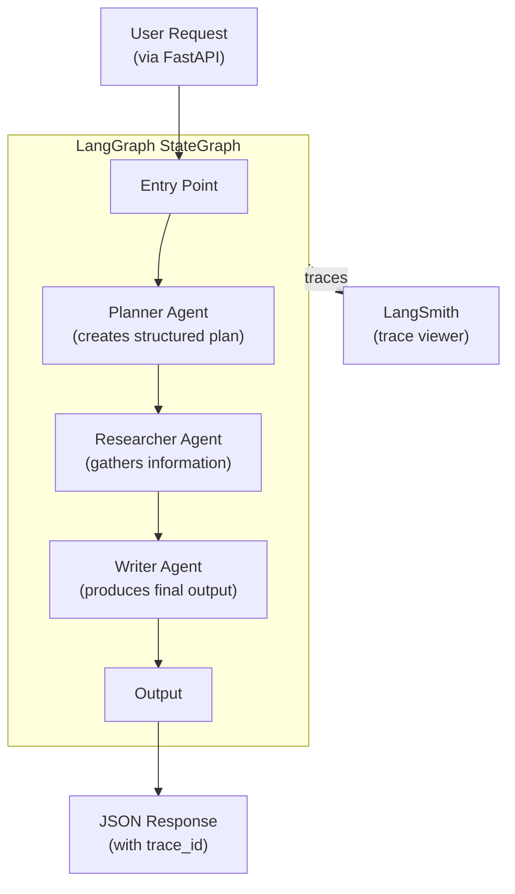

# Lesson 1: Multi-Agent System as a Single System

## What You'll Learn

- How to build a multi-agent system using LangGraph's StateGraph
- The orchestrator pattern: one graph coordinates multiple specialized agents
- How to integrate LangSmith tracing to observe every agent decision and tool call
- How to use verbose mode to debug and understand agent reasoning
- How to containerize and run agents with Docker Compose

## The Problem

You need to build a content research and writing pipeline. A single monolithic LLM prompt tries to do everything -- plan, research, and write -- but produces inconsistent results. The planning is shallow, the research is not focused, and the writing doesn't follow the plan.

**The solution**: Split the work across three specialized agents that collaborate within a single system:

1. **Planner** -- analyzes the request and creates a structured plan
2. **Researcher** -- follows the plan to gather relevant information
3. **Writer** -- uses the plan and research to produce the final output

## Architecture



## Key Concepts

### LangGraph StateGraph

LangGraph models agent workflows as directed graphs where:
- **Nodes** are async functions that process and update shared state
- **Edges** define the flow between nodes (sequential, conditional, or parallel)
- **State** is a typed dictionary that flows through the graph

```python
from typing import TypedDict
from langgraph.graph import StateGraph, END

class AgentState(TypedDict):
    messages: list[str]
    plan: str
    research: str
    output: str

graph = StateGraph(AgentState)
graph.add_node("planner", planner_node)
graph.add_node("researcher", researcher_node)
graph.add_node("writer", writer_node)

graph.set_entry_point("planner")
graph.add_edge("planner", "researcher")
graph.add_edge("researcher", "writer")
graph.add_edge("writer", END)

app = graph.compile()
```

### Why Multiple Agents Instead of One?

| Aspect | Single Agent | Multi-Agent (This Lesson) |
|--------|-------------|--------------------------|
| Prompt complexity | Long, tries everything | Short, focused per role |
| Output quality | Inconsistent | Each step validates the previous |
| Debugging | Opaque "black box" | See each agent's reasoning |
| Extensibility | Hard to modify | Add/remove agents without breaking others |
| Cost | One expensive call | Multiple cheaper, focused calls |

### LangSmith Integration

LangSmith captures the full execution trace:
- Which agent ran, in what order
- What each agent received as input and produced as output
- How long each step took
- Token usage per agent

Every trace gets a unique ID that you can use to look up the execution in the LangSmith dashboard.

### Verbose Mode

When `VERBOSE=true`, every agent logs to stderr:

```
[14:32:01.234] [Planner] Processing request: "Write about distributed AI agents"
[14:32:01.235] [Planner]   └─ Creating structured plan...
[14:32:03.891] [Planner] Plan created with 3 sections
[14:32:03.892] [Researcher] Researching section 1: "Agent Communication Protocols"
[14:32:06.445] [Researcher] Found 5 relevant points
[14:32:06.446] [Writer] Writing final output based on plan and research
[14:32:09.123] [Writer] Output generated (847 words)
```

## Implementation Walkthrough

### Step 1: Define the State

The state is the data contract between all agents. Each agent reads what it needs and writes its output.

```python
class AgentState(TypedDict):
    input: str          # Original user request
    plan: str           # Planner's output
    research: str       # Researcher's output
    output: str         # Writer's final output
    messages: list[str] # Running log of agent activity
```

### Step 2: Build Agent Nodes

Each agent is an async function that takes state, does work, and returns updates.

```python
async def planner_node(state: AgentState) -> dict:
    verbose_log("Planner", f"Planning for: {state['input'][:100]}")
    llm = get_chat_model()
    response = await llm.ainvoke([
        SystemMessage(content="You are a planning agent. Create a structured plan."),
        HumanMessage(content=state["input"]),
    ])
    return {"plan": response.content}
```

### Step 3: Wire Up the Graph

Connect nodes with edges to define the execution flow.

### Step 4: Expose via FastAPI

Create a simple HTTP endpoint that invokes the graph and returns the result with a LangSmith trace ID.

## Running the Example

```bash
# From the repository root
cp .env.example .env
# Fill in AZURE_OPENAI_* or ANTHROPIC_API_KEY + LANGSMITH_API_KEY

# Run with Docker
docker compose -f examples/01-multi-agent-single-system/docker-compose.yml up --build

# Or with make
make example EX=01-multi-agent-single-system

# Test the health endpoint
curl http://localhost:8000/health

# Run the agent pipeline
curl -X POST http://localhost:8000/run \
  -H "Content-Type: application/json" \
  -d '{"input": "Write a brief analysis of AI agent communication protocols"}'
```

## What the Agents Are Doing (Debug Walkthrough)

When you send a request, the verbose output shows the full chain:

1. **FastAPI** receives the POST request and invokes the graph
2. **Planner** reads the input, calls the LLM to create a structured plan
3. **Researcher** reads the plan, calls the LLM to gather relevant information for each section
4. **Writer** reads both the plan and research, calls the LLM to produce the final output
5. **FastAPI** returns the output with the LangSmith trace ID

Open the trace ID in LangSmith to see a visual timeline of each step, token usage, and latencies.

## Exercises

1. **Add a fourth agent**: Add a "reviewer" agent that reads the writer's output and suggests improvements. Wire it into the graph between writer and END.
2. **Conditional routing**: Modify the graph so that if the planner determines the request is simple (e.g., less than 2 sections), it skips the researcher and goes directly to the writer.
3. **Try both providers**: Run the example with Azure OpenAI, then switch to Anthropic (change `LLM_PROVIDER=anthropic` in `.env`). Compare the outputs and trace data.

## Further Reading

- [LangGraph Documentation](https://langchain-ai.github.io/langgraph/)
- [LangSmith Documentation](https://docs.smith.langchain.com/)
- [StateGraph API Reference](https://langchain-ai.github.io/langgraph/reference/graphs/#langgraph.graph.StateGraph)
