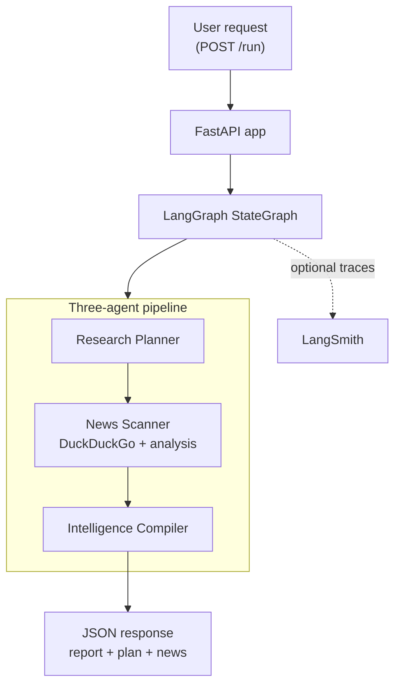

# Pattern 01: Orchestrator Pipeline

> Build a three-agent crypto research pipeline that turns one `POST /run` request into a plan, web research, and a structured report.

`Pattern 01 of 9`. This is the starting point for Team 1 (Intelligence): one FastAPI app, one LangGraph pipeline, one Docker service. It is intentionally simple, easy to run, and designed to make the next limitation obvious before [Pattern 02](../02-mcp-tool-integration/README.md) introduces MCP.

Useful context:
- [Curriculum](../../docs/curriculum.md)
- [Vision & Roadmap](../../docs/vision.md)
- [Next pattern: MCP Tool Integration](../02-mcp-tool-integration/README.md)

## Quick Start

You can run this example locally in a few minutes.

```bash
# From the repository root
cp .env.example .env

# Choose one LLM provider:
# - Azure OpenAI: fill AZURE_OPENAI_* (default)
# - Anthropic: fill ANTHROPIC_API_KEY and set LLM_PROVIDER=anthropic
#
# Optional but recommended once configured:
# - LANGSMITH_API_KEY for hosted LangSmith traces
# - Keep LANGSMITH_PROJECT=agent-patterns-lab and use per-example tags/metadata

cd examples/01-orchestrator-pipeline
docker compose up --build

# Verify the API
curl http://localhost:8000/health

# Run the pipeline
curl -X POST http://localhost:8000/run \
  -H "Content-Type: application/json" \
  -d '{"input": "Research the Arbitrum crypto project"}'
```

The primary UX is running from inside the example folder. A repo-root shortcut also exists:

```bash
make example EX=01-orchestrator-pipeline
```

If you prefer an HTTP client, use [`endpoints.http`](endpoints.http).

## What You Get Back

The API returns the final report and the intermediate artifacts that produced it:

```json
{
  "report": "## Executive Summary\n...",
  "plan": "1. Recent news\n2. Team background\n...",
  "news": "Recent findings synthesized from web search results..."
}
```

That response shape is deliberate. It makes the pipeline easier to debug and easier to learn from than a single opaque output blob.

## At a Glance

| Item | Details |
|------|---------|
| Pattern role | First runnable pattern in the series |
| Team | Team 1: Intelligence |
| Agents | Research Planner, News Scanner, Intelligence Compiler |
| Runtime | FastAPI + LangGraph in one container |
| Tooling | DuckDuckGo web search inside the News Scanner |
| Endpoints | `GET /health`, `POST /run` |
| Input validation | `input` must be 3-500 characters |
| Success signal | `/run` returns `report`, `plan`, and `news` |
| Observability | `VERBOSE=true` logs to stderr; hosted LangSmith tracing is enabled when `LANGSMITH_API_KEY` is set and runs are tagged with example, environment, runtime, and provider metadata |

## The Problem

A single monolithic LLM prompt tries to plan, research, and write all at once. The result is usually shallow planning, unfocused research, and inconsistent output.

This pattern fixes that by splitting the job across three specialized agents:

| Agent | Role | Tool |
|-------|------|------|
| Research Planner | Turns the request into a focused research plan | None |
| News Scanner | Searches the web and summarizes relevant findings | DuckDuckGo |
| Intelligence Compiler | Converts the plan and findings into a structured report | None |

The point is not "more agents = better." The point is that each step gets a clearer responsibility, a shorter prompt, and observable handoffs.

## Architecture



## When to Use / When Not to Use

**Use this pattern when:**
- You want the simplest real multi-agent architecture that still shows clear orchestration boundaries.
- You need one service with a few specialized steps and shared typed state.
- You want a strong teaching or debugging story before adding more infrastructure.

**Avoid this pattern when:**
- Tools need to be shared across multiple agents, services, or AI clients. That is the motivation for [Pattern 02](../02-mcp-tool-integration/README.md).
- You need persistence across requests. This pattern starts fresh every time.
- You need independent deployment, scaling, or trust boundaries between agent groups.

## Key Concepts

- **StateGraph**: a typed state object flows through explicit graph nodes and edges.
- **Focused agents**: each node does one job well instead of carrying one giant all-in-one prompt.
- **Observable execution**: verbose logs and optional LangSmith traces make every handoff visible.
- **Graceful degradation**: node-level failures fall back to partial outputs instead of crashing immediately.

## Implementation Walkthrough

### Step 1: Define the shared state

The state is the contract between agents. Every node reads what it needs and writes one focused output.

```python
class AgentState(TypedDict, total=False):
    input: Required[str]
    plan: str
    news: str
    report: str
```

### Step 2: Build focused async nodes

Every agent follows the same shape: read state, do one job, return a partial update.

The News Scanner is the most interesting node because it combines tool use with an LLM pass and degrades gracefully if search or model calls fail:

```python
async def news_scanner_node(state: AgentState) -> dict[str, str]:
    try:
        search = DuckDuckGoSearchResults(max_results=8, output_format="list")
        current_year = datetime.now(UTC).year
        raw_results = await search.ainvoke(
            f"{state['input']} crypto project news {current_year}"
        )
    except Exception as exc:
        raw_results = f"[Search unavailable: {type(exc).__name__}]"

    llm = get_chat_model()
    response = await llm.ainvoke([...])
    return {"news": str(response.content)}
```

That design keeps the pipeline educational and resilient: a weak dependency produces degraded output, not an unreadable black box failure.

### Step 3: Wire the graph explicitly

Pattern 01 is a straight-line orchestrator pipeline:

```python
graph = StateGraph(AgentState)
graph.add_node("research_planner", research_planner_node)
graph.add_node("news_scanner", news_scanner_node)
graph.add_node("intelligence_compiler", intelligence_compiler_node)

graph.set_entry_point("research_planner")
graph.add_edge("research_planner", "news_scanner")
graph.add_edge("news_scanner", "intelligence_compiler")
graph.add_edge("intelligence_compiler", END)

compiled_graph = graph.compile()
```

### Step 4: Expose the graph via FastAPI

The FastAPI app builds the graph at startup, keeps it on `app.state`, and invokes it from `POST /run`.

```python
@asynccontextmanager
async def lifespan(fastapi_app: FastAPI) -> AsyncIterator[None]:
    setup_tracing()
    fastapi_app.state.graph = build_graph()
    yield

@app.post("/run", response_model=RunResponse)
async def run(request: RunRequest) -> RunResponse | JSONResponse:
    result = await app.state.graph.ainvoke({"input": request.input})
    return RunResponse(
        report=result.get("report", ""),
        plan=result.get("plan", ""),
        news=result.get("news", ""),
    )
```

Two API details are worth noticing:
- `input` is validated by Pydantic and must be between 3 and 500 characters.
- If graph execution raises an exception, the endpoint returns `502` with `{"error": "pipeline_failed", "detail": "..."}`.

## What You Should See

With `VERBOSE=true`, container logs show each handoff clearly:

```text
[14:32:01.234] [ResearchPlanner] Planning research for: Research Arbitrum
[14:32:03.891] [ResearchPlanner] Plan created (245 chars)
[14:32:03.892] [NewsScanner] Searching for: Research Arbitrum
[14:32:06.445] [NewsScanner] Got 8 search results
[14:32:08.901] [NewsScanner] Analysis complete (523 chars)
[14:32:08.902] [IntelligenceCompiler] Compiling intelligence report
[14:32:11.678] [IntelligenceCompiler] Report generated (847 chars)
```

If `LANGSMITH_API_KEY` is set, startup also enables hosted LangSmith tracing under the shared `agent-patterns-lab` project. Public runs add per-example tags and metadata automatically so one project can still be filtered by example, environment, runtime, and provider. If tracing is requested but no key is set, the app logs a clear warning, disables tracing, and keeps running.

## Verification

Use these checks to confirm the example behaves the way the code and tests expect:

```bash
# Healthy service
curl http://localhost:8000/health

# Valid request
curl -X POST http://localhost:8000/run \
  -H "Content-Type: application/json" \
  -d '{"input": "Research the Solana crypto project"}'

# Validation failure (too short)
curl -X POST http://localhost:8000/run \
  -H "Content-Type: application/json" \
  -d '{"input": "ab"}'
```

Expected behavior:
- `GET /health` returns `{"status": "ok"}`
- Valid `POST /run` returns `report`, `plan`, and `news`
- Invalid input returns `422`
- Unhandled graph failure returns `502`

## Local Development

Docker is the fastest way to try this example. If you want to work on the code
locally, `uv` is the workspace tool for syncing dependencies, running tests, and
checking types.

```bash
# From the repository root
uv sync --all-packages

# Run the repository test suite
uv run python scripts/testing/run_test_suite.py

# Run the repository type-check wrapper
uv run python scripts/linting/run_mypy.py
```

Use this path when you want to iterate on the codebase itself rather than just
run the example container.

## Exercises

1. Add a fourth agent between the News Scanner and Intelligence Compiler to fact-check claims before report generation.
2. Introduce conditional routing so well-known projects take a shorter research path.
3. Split research into two parallel branches and compare the trade-off against this simple sequential flow.

## Trade-offs

| Advantage | Limitation |
|-----------|-----------|
| Very easy to understand and run | Sequential execution adds latency |
| Clear boundaries between responsibilities | All agents live in one process |
| Great observability for learning and debugging | Every request starts from scratch |
| Tool use is easy to add inside a node | Tools are hardcoded, not standardized |

This last limitation is the reason [Pattern 02](../02-mcp-tool-integration/README.md) exists. Once tools need to be reused by multiple agents or external AI clients, direct Python tool calls stop scaling.

## Further Reading

- [LangGraph Documentation](https://langchain-ai.github.io/langgraph/)
- [LangSmith Documentation](https://docs.smith.langchain.com/)
- [StateGraph API Reference](https://langchain-ai.github.io/langgraph/reference/graphs/)
