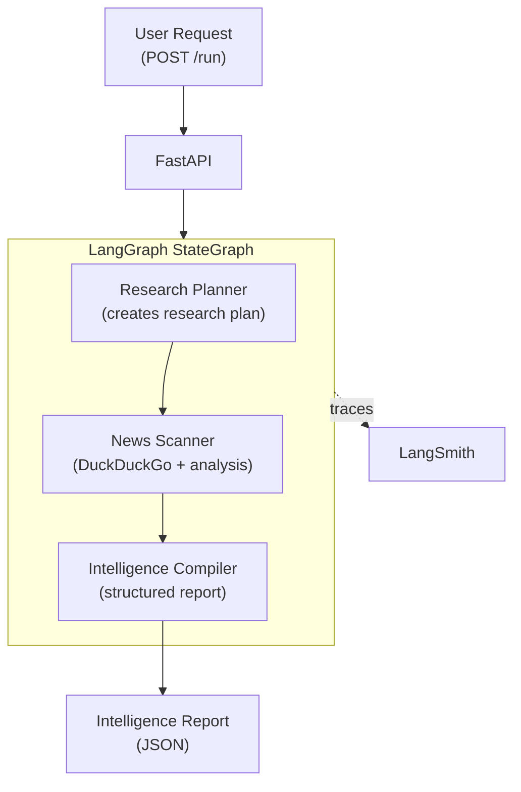

# Pattern 01: Orchestrator Pipeline

> Decompose a complex research task across multiple specialized agents using LangGraph StateGraph.

## What You'll Learn

- How to build a multi-agent system using LangGraph's StateGraph
- The orchestrator pattern: one graph coordinates multiple specialized agents
- How to integrate external tools (web search) into agent nodes
- How to use LangSmith tracing to observe every agent decision
- How to containerize and run agents with Docker Compose

## The Problem

You need to build a crypto project intelligence system. A single monolithic LLM prompt tries to plan, research, and write all at once -- the planning is shallow, the research unfocused, and the report inconsistent.

**The solution**: Split responsibility across three focused agents that collaborate within a single LangGraph StateGraph:

1. **Research Planner** -- analyzes the request and creates a structured research plan
2. **News Scanner** -- searches the web for relevant information using DuckDuckGo
3. **Intelligence Compiler** -- synthesizes findings into a structured intelligence report

## Architecture



## Key Concepts

### LangGraph StateGraph

LangGraph models agent workflows as directed graphs:

- **Nodes** are async functions that process and update shared state
- **Edges** define the flow between nodes (sequential, conditional, or parallel)
- **State** is a typed dictionary that flows through the graph

```python
class AgentState(TypedDict, total=False):
    input: Required[str]
    plan: str
    news: str
    report: str
```

### Why Multiple Agents Instead of One?

| Aspect | Single Agent | Multi-Agent (This Pattern) |
|--------|-------------|---------------------------|
| Prompt complexity | Long, tries everything | Short, focused per role |
| Output quality | Inconsistent | Each step validates the previous |
| Debugging | Opaque "black box" | See each agent's reasoning in LangSmith |
| Extensibility | Hard to modify | Add/remove agents without breaking others |
| Cost | One expensive call | Multiple cheaper, focused calls |

### LangSmith Integration

LangSmith captures the full execution trace -- which agent ran, inputs/outputs, timing, and token usage. Every trace gets a unique ID for dashboard lookup.

### Verbose Mode

When `VERBOSE=true`, every agent logs to stderr with timestamps:

```
[14:32:01.234] [ResearchPlanner] Planning research for: Research Arbitrum
[14:32:03.891] [ResearchPlanner] Plan created (245 chars)
[14:32:03.892] [NewsScanner] Searching for: Research Arbitrum
[14:32:06.445] [NewsScanner] Got 8 search results
[14:32:08.901] [NewsScanner] Analysis complete (523 chars)
[14:32:08.902] [IntelligenceCompiler] Compiling intelligence report
[14:32:11.678] [IntelligenceCompiler] Report generated (847 chars)
```

## Implementation

### Step 1: Define the State

The state is the data contract between all agents. Each agent reads what it needs and writes its output.

```python
class AgentState(TypedDict, total=False):
    input: Required[str]   # Crypto project query
    plan: str              # Research Planner's output
    news: str              # News Scanner's analyzed findings
    report: str            # Intelligence Compiler's final report
```

### Step 2: Build Agent Nodes

Each agent is an async function that takes state, does work, and returns updates.

```python
async def research_planner_node(state: AgentState) -> dict[str, str]:
    llm = get_chat_model()
    response = await llm.ainvoke([
        SystemMessage(content=SYSTEM_PROMPT),
        HumanMessage(content=state["input"]),
    ])
    return {"plan": str(response.content)}
```

The News Scanner adds a tool call -- DuckDuckGo web search:

```python
async def news_scanner_node(state: AgentState) -> dict[str, str]:
    search = DuckDuckGoSearchResults(max_results=8, output_format="list")
    raw_results = await search.ainvoke(f"{state['input']} crypto project news 2026")

    llm = get_chat_model()
    response = await llm.ainvoke([
        SystemMessage(content=SYSTEM_PROMPT),
        HumanMessage(content=f"Query: {state['input']}\nPlan: {state['plan']}\nResults: {raw_results}"),
    ])
    return {"news": str(response.content)}
```

### Step 3: Wire the Graph

```python
graph = StateGraph(AgentState)
graph.add_node("research_planner", research_planner_node)
graph.add_node("news_scanner", news_scanner_node)
graph.add_node("intelligence_compiler", intelligence_compiler_node)

graph.set_entry_point("research_planner")
graph.add_edge("research_planner", "news_scanner")
graph.add_edge("news_scanner", "intelligence_compiler")
graph.add_edge("intelligence_compiler", END)

app = graph.compile()
```

### Step 4: Expose via FastAPI

A simple HTTP endpoint invokes the graph and returns the structured report.

## Running the Example

```bash
# From the repository root
cp .env.example .env
# Fill in AZURE_OPENAI_* or ANTHROPIC_* + LANGSMITH_API_KEY as needed

# Run from inside the example folder
cd examples/01-orchestrator-pipeline
docker compose up --build

# Verify the API is healthy
curl http://localhost:8000/health

# Submit a research request
curl -X POST http://localhost:8000/run \
  -H "Content-Type: application/json" \
  -d '{"input": "Research the Arbitrum crypto project"}'
```

### Optional repo-root shortcut

```bash
# Run the same example without changing directories
make example EX=01-orchestrator-pipeline

# You can also send requests from `endpoints.http`
```

## Exercises

1. **Add a fourth agent**: Add a "Fact Checker" agent between the News Scanner and Intelligence Compiler that validates claims found in the research.
2. **Conditional routing**: Modify the graph so that if the Research Planner determines the request is about a well-known project (BTC, ETH), it uses a shorter plan.
3. **Parallel research**: Split the News Scanner into two parallel nodes -- one for news and one for project/team info -- using LangGraph's fan-out pattern.

## Trade-offs

| Advantage | Limitation |
|-----------|-----------|
| Clear separation of concerns | Sequential execution adds latency |
| Easy to debug with LangSmith traces | All agents share a single process |
| Each agent's prompt is short and focused | No persistence -- every request starts fresh |
| Tool use is straightforward | Tools are hardcoded, not standardized |

**Next pattern** (Pattern 02) addresses the last two limitations by adding MCP for standardized tool access and introducing additional agents.

## Further Reading

- [LangGraph Documentation](https://langchain-ai.github.io/langgraph/)
- [LangSmith Documentation](https://docs.smith.langchain.com/)
- [StateGraph API Reference](https://langchain-ai.github.io/langgraph/reference/graphs/)
