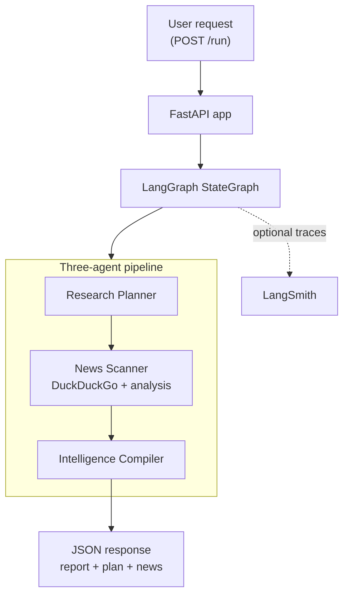

# Pattern 01: Orchestrator Pipeline

> Build a three-agent crypto research pipeline that turns one `POST /run` request into a plan, web research, and a structured report.

`Pattern 01 of 9`. This is the starting point for Team 1 (Intelligence): one FastAPI app, one LangGraph pipeline, one Docker service. It is intentionally simple, easy to run, and designed to make the next limitation obvious before [Pattern 02](../02-mcp-tool-integration/README.md) introduces MCP.

Useful context:
- [Curriculum](../../docs/curriculum.md)
- [Vision & Roadmap](../../docs/vision.md)
- [Next pattern: MCP Tool Integration](../02-mcp-tool-integration/README.md)

## Quick Start

You can run this example locally in a few minutes.

```bash
# From the repository root
cp .env.example .env

# Choose one LLM provider:
# - Azure OpenAI: fill AZURE_OPENAI_* (default)
# - Anthropic: fill ANTHROPIC_API_KEY and set LLM_PROVIDER=anthropic
#
# Optional but recommended once configured:
# - LANGSMITH_API_KEY for hosted LangSmith traces
# - Keep LANGSMITH_PROJECT=agent-patterns-lab and use per-example tags/metadata

cd examples/01-orchestrator-pipeline
docker compose up --build

# Verify the API
curl http://localhost:8000/health

# Run the pipeline
curl -X POST http://localhost:8000/run \
  -H "Content-Type: application/json" \
  -d '{"input": "Research the Arbitrum crypto project"}'
```

The primary UX is running from inside the example folder. A repo-root shortcut also exists:

```bash
make example EX=01-orchestrator-pipeline
```

If you prefer prebuilt requests, use [`endpoints.http`](endpoints.http).

## What You Get Back

The API returns the final report and the intermediate artifacts that produced it:

```json
{
  "report": "## Executive Summary\n...",
  "plan": "1. Recent news\n2. Team background\n...",
  "news": "Recent findings synthesized from web search results..."
}
```

That response shape is deliberate. It makes the pipeline easier to debug and easier to learn from than a single opaque output blob.

## At a Glance

| Item | Details |
|------|---------|
| Pattern role | First runnable pattern in the series |
| Team | Team 1: Intelligence |
| Agents | Research Planner, News Scanner, Intelligence Compiler |
| Runtime | FastAPI + LangGraph in one container |
| Tooling | DuckDuckGo web search inside the News Scanner |
| Endpoints | `GET /health`, `POST /run` |
| Input validation | `input` must be 3-500 characters |
| Success signal | `/run` returns `report`, `plan`, and `news` |
| Observability | `VERBOSE=true` logs to stderr; hosted LangSmith tracing is enabled when `LANGSMITH_API_KEY` is set and runs are tagged with example, environment, runtime, and provider metadata |

## The Problem

A single monolithic LLM prompt tries to plan, research, and write all at once. The result is usually shallow planning, unfocused research, and inconsistent output.

This pattern fixes that by splitting the job across three specialized agents:

| Agent | Role | Tool |
|-------|------|------|
| Research Planner | Turns the request into a focused research plan | None |
| News Scanner | Searches the web and summarizes relevant findings | DuckDuckGo |
| Intelligence Compiler | Converts the plan and findings into a structured report | None |

The point is not "more agents = better." The point is that each step gets a clearer responsibility, a shorter prompt, and observable handoffs.

## Architecture



The architecture is intentionally linear. Pattern 01 is meant to make the orchestration boundaries obvious before the series adds more infrastructure, more protocols, or more runtime concerns.

## Key Concepts

- **Typed state** -- one shared `AgentState` object is the contract between all nodes.
- **Focused agents** -- each node does one job instead of carrying one giant prompt.
- **Explicit graph wiring** -- the orchestration is visible in LangGraph edges, not hidden in prompt text.
- **Graceful degradation** -- weak dependencies can produce partial output instead of collapsing the whole run.

## Implementation Walkthrough

1. Define the shared state in [`src/agents/state.py`](src/agents/state.py). It keeps the contract deliberately small: request input, planner output, research output, and final report.
2. Define the three focused nodes in [`src/agents/research_planner.py`](src/agents/research_planner.py), [`src/agents/news_scanner.py`](src/agents/news_scanner.py), and [`src/agents/intelligence_compiler.py`](src/agents/intelligence_compiler.py). Each node reads only the fields it needs and returns one partial state update.
3. Wire the straight-line graph in [`src/agents/graph.py`](src/agents/graph.py). This is the core orchestrator pattern: planner -> scanner -> compiler.
4. Expose the graph through FastAPI in [`src/app.py`](src/app.py). Startup initializes tracing and the compiled graph, while `POST /run` validates input, invokes the graph, and returns the intermediate artifacts together with the final report.

Two API details matter for the developer experience:
- `input` is validated by Pydantic and must be between 3 and 500 characters.
- Graph execution failures return `502` with `{"error": "pipeline_failed", "detail": "..."}` instead of a silent container error.

## Local Development

Docker is the fastest way to try this example. If you want to work on the code locally, `uv` is the workspace tool for syncing dependencies, running tests, and checking types.

```bash
# From the repository root
uv sync --all-packages

# Run the repository test suite
uv run python scripts/testing/run_test_suite.py

# Run the repository type-check wrapper
uv run python scripts/linting/run_mypy.py
```

Use this path when you want to iterate on the codebase itself rather than just run the example container.

## What You Have Learned

- How to express a simple multi-agent workflow as a typed LangGraph `StateGraph`.
- How to split planning, tool use, and synthesis into separate async nodes with clear handoffs.
- How to expose a LangGraph pipeline through a minimal FastAPI boundary with useful intermediate artifacts.
- Why a simple orchestrator pattern is a good teaching baseline before adding more protocols or runtime complexity.

**Next:** [Pattern 02: MCP Tool Integration](../02-mcp-tool-integration/README.md) extends this pipeline with a second entry point and turns the full capability into an MCP tool so AI clients can call it directly.

If this project helps you, consider giving it a [star on GitHub](https://github.com/ksopyla/agent-patterns-lab).

## Further Reading

- [LangGraph Documentation](https://langchain-ai.github.io/langgraph/)
- [LangSmith Documentation](https://docs.smith.langchain.com/)
- [StateGraph API Reference](https://langchain-ai.github.io/langgraph/reference/graphs/)
