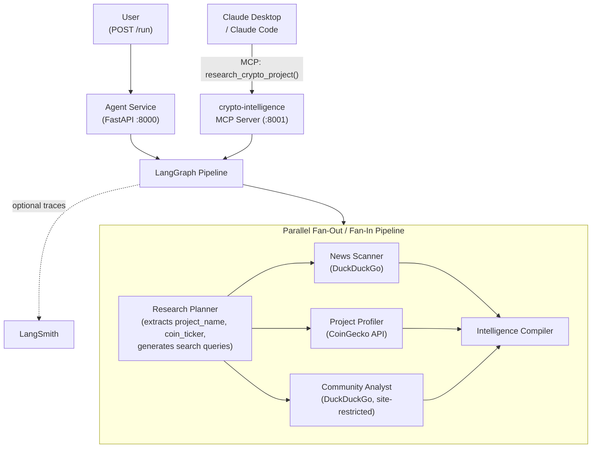

# Pattern 02: MCP Tool Integration

> Expose your agent pipeline as an MCP tool and run research agents in parallel -- one protocol, one tool call, full intelligence report.

`Pattern 02 of 9`. Expands Team 1 (Intelligence) from 3 agents to the full 5-agent lineup with a **parallel fan-out/fan-in** architecture and adds a second entry point: alongside `POST /run` (REST), the same pipeline is now accessible as an MCP tool. This is the Software 3.0 lesson -- the "UI" is Claude Desktop, not a bespoke chat widget.

Useful context:
- [Curriculum](../../docs/curriculum.md)
- [Vision & Roadmap](../../docs/vision.md)
- [Previous pattern: Orchestrator Pipeline](../01-orchestrator-pipeline/README.md)
- [Next pattern: Checkpoint Recovery and Resilience](../03-checkpoint-recovery/README.md)

## Quick Start

```bash
# From the repository root
cp .env.example .env

# Required:
# - Azure OpenAI (AZURE_OPENAI_*) or Anthropic (ANTHROPIC_API_KEY + LLM_PROVIDER=anthropic)
#
# Optional but recommended:
# - LANGSMITH_API_KEY for hosted LangSmith traces

cd examples/02-mcp-tool-integration
docker compose up --build

# Test the REST entry point
curl http://localhost:8000/health
curl -X POST http://localhost:8000/run \
  -H "Content-Type: application/json" \
  -d '{"input": "Research the Arbitrum crypto project"}'
```

The MCP entry point is at `localhost:8001/sse` -- connect Claude Code, Cursor, or Claude Desktop (see [Connect Your MCP Client](#connect-your-mcp-client) below).

If you prefer prebuilt REST requests, use [`endpoints.http`](endpoints.http).

## What You Get Back

Both entry points (REST and MCP) run the same 5-agent pipeline and produce the same final intelligence report. The REST API returns the full intermediate artifact set for debugging, while the MCP tool returns the final `report` only because MCP tools should expose outcomes rather than internal pipeline state:

```json
{
  "report": "## Executive Summary\nArbitrum is a leading Layer 2...",
  "plan": "1. Recent news and partnerships\n2. Project fundamentals...",
  "news": "Key findings from web search: Arbitrum announced...",
  "profile": "Technology: Optimistic rollup on Ethereum. Market cap: $2.8B...",
  "community": "Community Health: Strong. GitHub: 847 commits last month..."
}
```

Via MCP, Claude Desktop receives the `report` field directly -- a complete analysis in one tool call. This asymmetry is intentional: REST is optimized for developer inspection, MCP is optimized for outcome-oriented tool use.

## At a Glance

| Item | Details |
|------|---------|
| Pattern role | Introduces MCP -- expose agent capabilities to AI clients |
| Team | Team 1: Intelligence (full 5-agent lineup) |
| Agents | Research Planner, News Scanner, Project Profiler, Community Analyst, Intelligence Compiler |
| Graph | Parallel fan-out/fan-in: planner → [news \| profiler \| community] → compiler |
| Entry points | REST: `POST /run` (:8000) · MCP: `research_crypto_project` tool (:8001) |
| MCP tool | `research_crypto_project(query)` -- runs the full pipeline |
| Data sources | News Scanner: DuckDuckGo · Project Profiler: CoinGecko API · Community Analyst: DuckDuckGo (site-restricted) |
| Runtime | Agent container (FastAPI) + MCP server container (same image, different command) |
| Input validation | `input` must be 3-500 characters (REST); `query` is free-text (MCP) |
| Timeout behavior | Both entry points execute synchronously with a 120s timeout boundary |
| Observability | `VERBOSE=true` logs to stderr; hosted LangSmith tracing when `LANGSMITH_API_KEY` is set |

## The Problem

Pattern 01 has two limitations. First, the pipeline is locked behind `POST /run` -- Claude Desktop, Cursor, and other AI clients can't call it. MCP fixes this by exposing the agent's capability as a standard protocol tool that any MCP client discovers automatically.

Second, the three research agents run sequentially even though they have zero data dependencies on each other. Parallel fan-out cuts wall-clock time by running them concurrently.

## Architecture



The MCP server and REST API share the same Docker image but run as **separate containers** -- one serves `POST /run` on `:8000`, the other serves the MCP SSE endpoint on `:8001`. This way a developer can use either entry point (or both) without any code changes. Both invoke the same compiled LangGraph, where three research nodes fan out in parallel after the planner and fan in at the compiler.

## Key Concepts

- **Outcome-oriented MCP tool** -- expose `research_crypto_project`, not raw API wrappers like `get_coin_price`.
- **Parallel fan-out/fan-in** -- three research nodes run concurrently and the compiler waits for all three.
- **Data source ownership** -- each node owns one external source, which keeps responsibilities clean.
- **Synchronous execution boundary** -- REST and MCP both wait for the full result and fail fast after 120 seconds.

## Implementation Walkthrough

1. Define the expanded Team 1 state in [`src/agents/state.py`](src/agents/state.py). Pattern 02 grows beyond Pattern 01 by adding planner-generated identifiers and branch-specific outputs such as `project_name`, `coin_ticker`, `news_queries`, `community_queries`, `profile`, and `community`.
2. Define the five agent nodes in [`src/agents/research_planner.py`](src/agents/research_planner.py), [`src/agents/news_scanner.py`](src/agents/news_scanner.py), [`src/agents/project_profiler.py`](src/agents/project_profiler.py), [`src/agents/community_analyst.py`](src/agents/community_analyst.py), and [`src/agents/intelligence_compiler.py`](src/agents/intelligence_compiler.py). The important design choice is data-source ownership: DuckDuckGo stays in the search nodes and CoinGecko stays in the profiler.
3. Wire the parallel fan-out / fan-in graph in [`src/agents/graph.py`](src/agents/graph.py). After `research_planner`, LangGraph launches the three research branches in parallel and waits until all of them finish before the compiler runs.
4. Expose the same graph through two entry points: REST in [`src/app.py`](src/app.py) and MCP in [`src/mcp_servers/crypto_intelligence.py`](src/mcp_servers/crypto_intelligence.py). Shared timeout and tracing metadata live in [`src/runtime.py`](src/runtime.py), which keeps both transports aligned.
5. Package both transports with one Docker image in [`docker-compose.yml`](docker-compose.yml). The agent and MCP server are separate containers with different commands, but they serve the same capability.

## Connect Your MCP Client

With `docker compose up` running, connect from your tool of choice:

**Claude Code:**
```bash
claude mcp add --transport sse crypto-intelligence http://localhost:8001/sse
```

**Cursor** -- add to your project's `.cursor/mcp.json`:
```json
{
  "mcpServers": {
    "crypto-intelligence": {
      "url": "http://localhost:8001/sse"
    }
  }
}
```

**Claude Desktop** -- add to `%APPDATA%\Claude\claude_desktop_config.json` (macOS: `~/Library/Application Support/Claude/claude_desktop_config.json`):
```json
{
  "mcpServers": {
    "crypto-intelligence": {
      "url": "http://localhost:8001/sse"
    }
  }
}
```

Then ask: *"Research the Solana crypto project"*.

## Local Development

```bash
# From the repository root
uv sync --all-packages
uv run python scripts/testing/run_test_suite.py
uv run python scripts/linting/run_mypy.py
```

## What You Have Learned

- How to expose an agent capability through MCP instead of only through a REST endpoint.
- How to use LangGraph fan-out / fan-in to parallelize independent research branches.
- How to keep one graph behind two transports without duplicating business logic.
- Why outcome-oriented tools are a better MCP interface than exposing raw API plumbing.

**Next:** [Pattern 03: Checkpoint Recovery and Resilience](../03-checkpoint-recovery/README.md) keeps the same Team 1 graph but adds durable execution, retry-after-failure, and human-in-the-loop interrupts for ambiguous project selection.

If this project helps you, consider giving it a [star on GitHub](https://github.com/ksopyla/agent-patterns-lab).

## Further Reading

- [FastMCP (MCP Python SDK)](https://github.com/modelcontextprotocol/python-sdk) -- the `FastMCP` class used in this pattern
- [MCP Server Design Best Practices](https://www.philschmid.de/mcp-best-practices) -- expose outcomes, not raw APIs
- [LangGraph: Parallel Branch Execution](https://langchain-ai.github.io/langgraph/how-tos/branching/) -- the fan-out/fan-in pattern used in this graph
- [MCP Specification](https://modelcontextprotocol.io/)
