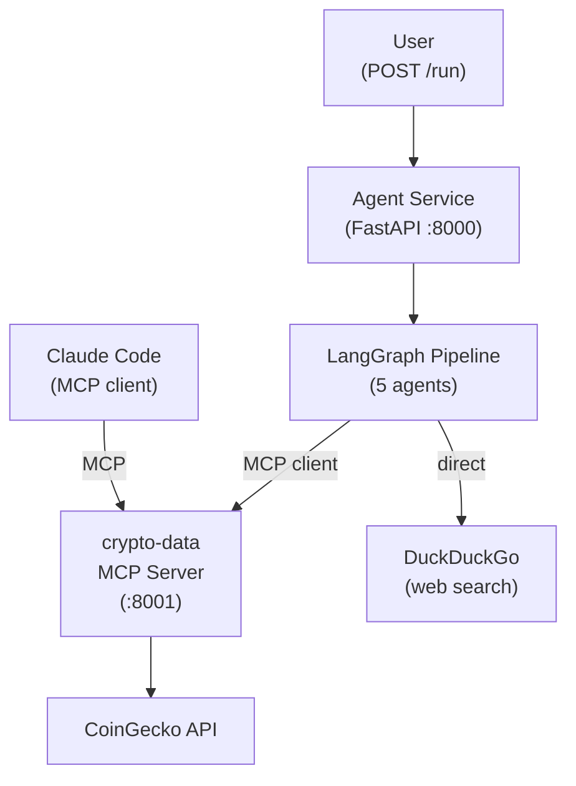

# Pattern 02: MCP Tool Integration

> Give agents standardized access to external data sources via the Model Context Protocol.

## What You'll Learn

- How to build a custom MCP server that wraps an external API (CoinGecko)
- How to connect LangGraph agents as MCP clients using `langchain-mcp-adapters`
- The value of tool abstraction: agents don't know/care about the underlying API
- How to run multi-container setups with Docker Compose (agent + MCP server)
- How Claude Code can connect to the same MCP servers your agents use

## The Problem

In Pattern 01, the News Scanner calls DuckDuckGo directly -- the tool is a hardcoded Python function. This approach doesn't scale:

- **New tools require code changes** in every agent that needs them
- **No sharing** -- Claude Code, Cursor, or other AI clients can't access the same tools
- **No standardization** -- each tool has a different interface, error handling, auth model

**The solution**: Model Context Protocol (MCP). Build tools as MCP servers, and any MCP-compatible client -- your agents, Claude Code, Cursor -- can discover and use them through a standard protocol.

## Architecture



## Key Concepts

### MCP: The USB-C of AI Tools

MCP standardizes how AI models access tools, similar to how USB-C standardized device connectivity. An MCP server exposes tools with typed schemas, and any MCP client can discover and call them.

```
MCP Server                        MCP Client
+------------------------+        +------------------+
| search_coins(query)    | <----> | LangGraph Agent  |
| get_coin_info(coin_id) |        | Claude Code      |
| get_coin_price(coin_id)|        | Cursor           |
+------------------------+        +------------------+
```

### Building an MCP Server

```python
from mcp.server.fastmcp import FastMCP

mcp = FastMCP("crypto-data")

@mcp.tool()
async def get_coin_price(coin_id: str, vs_currency: str = "usd") -> str:
    """Get current price, market cap, volume for a cryptocurrency."""
    data = await _coingecko_get("/simple/price", {"ids": coin_id, ...})
    return json.dumps(data)

if __name__ == "__main__":
    mcp.run(transport="sse")
```

### Connecting Agents as MCP Clients

```python
from langchain_mcp_adapters.client import MultiServerMCPClient

async with MultiServerMCPClient({
    "crypto-data": {"url": "http://crypto-data-mcp:8001/sse", "transport": "sse"}
}) as client:
    tools = client.get_tools()
    # tools are now standard LangChain tools -- use in any agent
```

### Pattern 01 vs Pattern 02

| Aspect | Pattern 01 (Direct) | Pattern 02 (MCP) |
|--------|-------------------|------------------|
| Tool access | Hardcoded Python calls | Standardized MCP protocol |
| Sharing | Only this codebase | Any MCP client (Claude Code, Cursor) |
| Adding tools | Code change in agents | Deploy new MCP server, agents discover it |
| Agents | 3 (minimal pipeline) | 5 (full Team 1) |
| New capabilities | None | CoinGecko project data, community stats |

## Implementation

### Step 1: Build the MCP Server

The `crypto-data` MCP server wraps three CoinGecko API endpoints as MCP tools:

- `search_coins(query)` -- find coins by name/symbol
- `get_coin_info(coin_id)` -- project description, links, community/developer stats
- `get_coin_price(coin_id)` -- current price, market cap, volume, 24h change

### Step 2: MCP Client Setup

A dedicated module (`mcp_setup.py`) manages the MCP client lifecycle:

- `init_mcp()` -- connects to MCP servers at app startup
- `close_mcp()` -- disconnects at shutdown
- `get_mcp_tool(name)` -- agents call this to access tools

### Step 3: Agents Use MCP Tools

The Project Profiler agent uses MCP to get structured data:

```python
async def project_profiler_node(state: AgentState) -> dict[str, str]:
    search_tool = get_mcp_tool("search_coins")
    search_results = await search_tool.ainvoke({"query": state["input"]})

    info_tool = get_mcp_tool("get_coin_info")
    coin_info = await info_tool.ainvoke({"coin_id": coin_id})

    # LLM analyzes the structured data
    llm = get_chat_model()
    response = await llm.ainvoke([...])
    return {"profile": str(response.content)}
```

### Step 4: Multi-Container Docker Compose

```yaml
services:
  crypto-data-mcp:
    command: ["python", "-m", "src.mcp_servers.crypto_data"]
    ports: ["8001:8001"]

  agent:
    environment:
      - CRYPTO_DATA_MCP_URL=http://crypto-data-mcp:8001/sse
    depends_on:
      - crypto-data-mcp
```

### Claude Code Integration

Add this to your Claude Code MCP config to use the same crypto-data tools:

```json
{
  "mcpServers": {
    "crypto-data": {
      "url": "http://localhost:8001/sse",
      "transport": "sse"
    }
  }
}
```

Now Claude Code can call `search_coins`, `get_coin_info`, and `get_coin_price` directly.

## Running the Example

```bash
# From the repository root
cp .env.example .env
# Fill in API keys

# Run with Docker (starts MCP server + agent)
docker compose -f examples/02-mcp-tool-integration/docker-compose.yml up --build

# Or with make
make example EX=02-mcp-tool-integration

# Test endpoints
curl http://localhost:8000/health

# Run the full intelligence pipeline
curl -X POST http://localhost:8000/run \
  -H "Content-Type: application/json" \
  -d '{"input": "Research the Arbitrum crypto project"}'
```

## Debug Walkthrough

With `VERBOSE=true`, you'll see MCP tool calls in the agent output:

```
[14:32:01] [MCP] Connecting to MCP servers: ['crypto-data']
[14:32:01] [MCP] Loaded 3 tools: ['search_coins', 'get_coin_info', 'get_coin_price']
[14:32:01] [System] FastAPI application started with MCP connections
[14:32:05] [ResearchPlanner] Planning research for: Research Arbitrum
[14:32:07] [NewsScanner] Searching for: Research Arbitrum
[14:32:10] [ProjectProfiler] Profiling: Research Arbitrum
[14:32:10] [ProjectProfiler] Coin search returned: [{"id": "arbitrum", ...}]
[14:32:11] [ProjectProfiler] Got coin info and price data via MCP
[14:32:14] [CommunityAnalyst] Got community/developer data via MCP
[14:32:17] [IntelligenceCompiler] Report generated (1247 chars)
```

## Exercises

1. **Add a new MCP tool**: Add `get_market_chart(coin_id, days)` to the crypto-data MCP server that returns price history. Modify the Community Analyst to use it.
2. **Build a second MCP server**: Create a `web-search` MCP server wrapping DuckDuckGo. Migrate the News Scanner from direct calls to MCP.
3. **Test with Claude Code**: Configure Claude Code to connect to your crypto-data MCP server and ask it questions about crypto projects.

## Trade-offs

| Advantage | Limitation |
|-----------|-----------|
| Standard protocol -- any MCP client works | Extra network hop (agent -> MCP server -> API) |
| Tools shared across agents and AI clients | MCP server becomes a dependency to manage |
| Adding tools doesn't require agent changes | Connection lifecycle management adds complexity |
| Clean separation: data access vs. intelligence | CoinGecko rate limits apply (30 req/min free tier) |

**Next pattern** (Pattern 03) adds persistent memory so the system remembers previous research across conversations.

## Further Reading

- [MCP Specification](https://modelcontextprotocol.io/)
- [MCP Python SDK](https://github.com/modelcontextprotocol/python-sdk)
- [langchain-mcp-adapters](https://github.com/langchain-ai/langchain-mcp-adapters)
- [CoinGecko Free API](https://docs.coingecko.com/reference/introduction)
