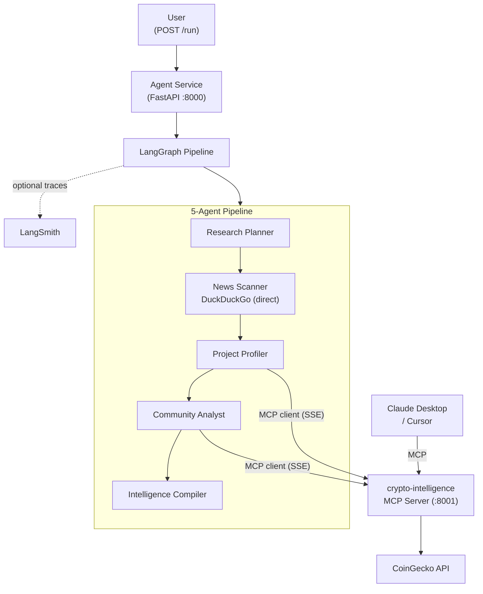

# Pattern 02: MCP Tool Integration

> Build a crypto-intelligence MCP server, connect agents as MCP clients, and let Claude Desktop use the same tools your agents do -- all through one protocol.

`Pattern 02 of 9`. Expands Team 1 (Intelligence) from 3 agents to the full 5-agent lineup. The core lesson is MCP: you **build** a domain-specific MCP server (crypto-intelligence wrapping CoinGecko) and connect agents as MCP clients. The News Scanner keeps its direct DuckDuckGo call -- MCP and direct tools coexist pragmatically. Any MCP-compatible client (Claude Desktop, Cursor) can connect to the same server.

Useful context:
- [Curriculum](../../docs/curriculum.md)
- [Vision & Roadmap](../../docs/vision.md)
- [Previous pattern: Orchestrator Pipeline](../01-orchestrator-pipeline/README.md)
- [Next pattern: Persistent Memory](../03-persistent-memory/README.md)

## Quick Start

```bash
# From the repository root
cp .env.example .env

# Required:
# - Azure OpenAI (AZURE_OPENAI_*) or Anthropic (ANTHROPIC_API_KEY + LLM_PROVIDER=anthropic)
#
# Optional but recommended:
# - LANGSMITH_API_KEY for hosted LangSmith traces
# - Keep LANGSMITH_PROJECT=agent-patterns-lab and use per-example tags/metadata

cd examples/02-mcp-tool-integration
docker compose up --build

# Verify both services
curl http://localhost:8000/health
curl http://localhost:8001/sse

# Run the full intelligence pipeline
curl -X POST http://localhost:8000/run \
  -H "Content-Type: application/json" \
  -d '{"input": "Research the Arbitrum crypto project"}'
```

The primary UX is running from inside the example folder. A repo-root shortcut also exists:

```bash
make example EX=02-mcp-tool-integration
```

If you prefer an HTTP client, use [`endpoints.http`](endpoints.http).

## What You Get Back

The API returns the final report and every intermediate artifact:

```json
{
  "report": "## Executive Summary\nArbitrum is a leading Layer 2...",
  "plan": "1. Recent news and partnerships\n2. Project fundamentals...",
  "news": "Key findings from web search: Arbitrum announced...",
  "profile": "Technology: Optimistic rollup on Ethereum. Market cap: $2.8B...",
  "community": "Community Health: Strong. GitHub: 847 commits last month..."
}
```

All five fields are exposed so you can trace exactly what each agent contributed. In Pattern 01 you had three fields; here you see the two new agents (Project Profiler, Community Analyst) adding structured data from CoinGecko via MCP.

## At a Glance

| Item | Details |
|------|---------|
| Pattern role | Introduces MCP -- the tool abstraction layer |
| Team | Team 1: Intelligence (full 5-agent lineup) |
| Agents | Research Planner, News Scanner, Project Profiler, Community Analyst, Intelligence Compiler |
| MCP server | `crypto-intelligence` (CoinGecko, SSE transport, :8001) |
| Direct tools | DuckDuckGo web search (News Scanner) |
| Runtime | FastAPI + LangGraph agent container + crypto-intelligence MCP container |
| Endpoints | `GET /health`, `POST /run` |
| Input validation | `input` must be 3-500 characters |
| Success signal | `/run` returns `report`, `plan`, `news`, `profile`, and `community` |
| Observability | `VERBOSE=true` logs to stderr; hosted LangSmith tracing when `LANGSMITH_API_KEY` is set |

## The Problem

In Pattern 01, the News Scanner calls DuckDuckGo directly -- a hardcoded Python function call. This approach has a fundamental limitation:

**You can't share tools.** Claude Desktop, Cursor, and other AI clients can't access your agent's crypto research capabilities. Your tools are locked inside your codebase.

MCP solves this by standardizing how tools are exposed and consumed:

| Aspect | Pattern 01 (Direct) | Pattern 02 (MCP) |
|--------|-------------------|------------------|
| Tool access | Hardcoded Python calls | Standardized MCP protocol |
| Sharing | Only this codebase | Any MCP client (Claude Desktop, Cursor) |
| Adding tools | Code change in agents | Deploy new MCP server, agents discover it |
| Agents | 3 (minimal pipeline) | 5 (full Team 1) |
| New capabilities | None | CoinGecko project data, community stats |

Not everything needs MCP. The News Scanner keeps its direct DuckDuckGo call because it's a commodity tool used by one agent. The crypto data tools are different -- they're domain-specific, reusable, and valuable to share with external clients.

## Architecture



## When to Use / When Not to Use

**Use this pattern when:**
- You want agents to access tools through a standard protocol instead of hardcoded function calls.
- You need to share agent capabilities with external AI clients (Claude Desktop, Cursor).
- You want a clear separation between tool implementation and agent logic.

**Avoid this pattern when:**
- You have one agent with one tool -- MCP adds overhead without benefit.
- You need persistent state across requests. Every call starts fresh. That's the motivation for [Pattern 03](../03-persistent-memory/README.md).
- You need agents in separate services communicating with each other. That's [Pattern 05](../05-distributed-a2a/README.md).

## Key Concepts

- **MCP server**: wraps an API as typed tools that any MCP client can discover and call.
- **MCP client**: agents connect to MCP servers via `langchain-mcp-adapters` and get standard LangChain tools.
- **SSE transport**: the crypto-intelligence MCP server runs as an HTTP service, accessible from any container or client.
- **Pragmatic coexistence**: not everything needs MCP. Use it for shared, reusable domain tools; keep direct calls for single-use commodity tools.
- **Tool abstraction**: agents call `get_mcp_tool("search_coins")` -- they don't know it hits CoinGecko behind the scenes.
- **Graceful degradation**: MCP tool failures and search failures produce degraded output, not crashes.

## Implementation Walkthrough

### Step 1: Build the crypto-intelligence MCP server

The MCP server wraps three CoinGecko endpoints as typed tools. Any MCP client -- agents, Claude Desktop -- discovers and calls them through the same protocol.

```python
from mcp.server.fastmcp import FastMCP

mcp = FastMCP("crypto-intelligence", host="0.0.0.0", port=8000)

@mcp.tool()
async def get_coin_price(coin_id: str, vs_currency: str = "usd") -> str:
    """Get current price, market cap, volume for a cryptocurrency."""
    data = await _coingecko_get("/simple/price", {"ids": coin_id, ...})
    return json.dumps(data)
```

Three tools exposed: `search_coins`, `get_coin_info`, `get_coin_price`.

### Step 2: Configure the MCP client

A dedicated module (`mcp_setup.py`) manages the MCP client lifecycle:

```python
def _get_mcp_config() -> dict[str, dict[str, Any]]:
    return {
        "crypto-intelligence": {
            "url": os.environ.get("CRYPTO_INTELLIGENCE_MCP_URL", "http://localhost:8001/sse"),
            "transport": "sse",
        },
    }
```

### Step 3: Agents use MCP tools

The Project Profiler uses MCP to get structured CoinGecko data:

```python
async def project_profiler_node(state: AgentState) -> dict[str, str]:
    search_tool = get_mcp_tool("search_coins")
    search_results = await search_tool.ainvoke({"query": query})

    info_tool = get_mcp_tool("get_coin_info")
    coin_info = await info_tool.ainvoke({"coin_id": coin_id})

    llm = get_chat_model()
    response = await llm.ainvoke([...])
    return {"profile": str(response.content)}
```

The News Scanner keeps DuckDuckGo as a direct tool -- same as Pattern 01 but with graceful degradation added.

### Step 4: Multi-container Docker Compose

```yaml
services:
  crypto-intelligence-mcp:
    command: ["uvicorn", "src.mcp_servers.crypto_intelligence:app", ...]
    ports: ["8001:8000"]

  agent:
    environment:
      - CRYPTO_INTELLIGENCE_MCP_URL=http://crypto-intelligence-mcp:8000/sse
    depends_on:
      - crypto-intelligence-mcp
```

### Claude Desktop Integration

With the crypto-intelligence MCP server running (via Docker or locally), add this to your Claude Desktop MCP config:

```json
{
  "mcpServers": {
    "crypto-intelligence": {
      "url": "http://localhost:8001/sse"
    }
  }
}
```

Now Claude Desktop can call `search_coins`, `get_coin_info`, and `get_coin_price` directly -- the same tools your agents use, through the same protocol.

## What You Should See

With `VERBOSE=true`, container logs show MCP connections and tool calls:

```text
[14:32:01.234] [MCP] Connecting to MCP servers: ['crypto-intelligence']
[14:32:01.567] [MCP] Loaded 3 tools: ['search_coins', 'get_coin_info', 'get_coin_price']
[14:32:01.568] [System] FastAPI application started with MCP connections
[14:32:05.234] [ResearchPlanner] Planning research for: Research Arbitrum
[14:32:07.891] [ResearchPlanner] Plan created (312 chars)
[14:32:07.892] [NewsScanner] Searching for: Research Arbitrum
[14:32:10.445] [NewsScanner] Got 8 search results
[14:32:13.234] [NewsScanner] Analysis complete (623 chars)
[14:32:13.235] [ProjectProfiler] Coin search returned: [{"id": "arbitrum", ...}]
[14:32:14.567] [ProjectProfiler] Got coin info and price data via MCP
[14:32:17.890] [CommunityAnalyst] Got community/developer data via MCP
[14:32:21.234] [IntelligenceCompiler] Report generated (1247 chars)
```

If `LANGSMITH_API_KEY` is set, tracing is enabled under the shared `agent-patterns-lab` project with per-example tags and metadata.

## Verification

Use these checks to confirm the example behaves correctly:

```bash
# Healthy agent service
curl http://localhost:8000/health

# Valid request (full pipeline)
curl -X POST http://localhost:8000/run \
  -H "Content-Type: application/json" \
  -d '{"input": "Research the Solana crypto project"}'

# Validation failure (too short)
curl -X POST http://localhost:8000/run \
  -H "Content-Type: application/json" \
  -d '{"input": "ab"}'
```

Expected behavior:
- `GET /health` returns `{"status": "ok"}`
- Valid `POST /run` returns `report`, `plan`, `news`, `profile`, and `community`
- Invalid input returns `422`
- MCP server unreachable returns `502` with `{"error": "pipeline_failed", "detail": "..."}`

## Local Development

Docker is the fastest way to try this example. If you want to work on the code
locally, `uv` is the workspace tool for syncing dependencies, running tests, and
checking types.

```bash
# From the repository root
uv sync --all-packages

# Run the repository test suite
uv run python scripts/testing/run_test_suite.py

# Run the repository type-check wrapper
uv run python scripts/linting/run_mypy.py
```

## Exercises

1. **Add a new MCP tool**: Add `get_market_chart(coin_id, days)` to the crypto-intelligence MCP server that returns price history. Modify the Community Analyst to use trend data in its assessment.
2. **Build a web-search MCP server**: Wrap DuckDuckGo as a second MCP server. Migrate the News Scanner from direct calls to MCP. Observe how the agent code barely changes.
3. **Consume an external MCP**: Configure the Brave Search MCP (`@brave/brave-search-mcp-server`) via stdio transport and connect your agents to it. Compare the two transport types (SSE vs stdio).
4. **Test with Claude Desktop**: Configure Claude Desktop to connect to your crypto-intelligence MCP server and ask it questions about crypto projects.

## Trade-offs

| Advantage | Limitation |
|-----------|-----------|
| Standard protocol -- any MCP client works | Extra network hop (agent → MCP server → API) |
| Tools shared with Claude Desktop, Cursor, other agents | MCP server becomes a dependency to manage |
| Adding tools doesn't require agent changes | Connection lifecycle management adds complexity |
| Clean separation: data access vs. intelligence | CoinGecko rate limits apply (30 req/min free tier) |

This last limitation -- every request starts from scratch, repeating web searches and API calls -- is the reason [Pattern 03](../03-persistent-memory/README.md) exists.

## Further Reading

- [MCP Specification](https://modelcontextprotocol.io/)
- [MCP Python SDK](https://github.com/modelcontextprotocol/python-sdk)
- [langchain-mcp-adapters](https://github.com/langchain-ai/langchain-mcp-adapters)
- [CoinGecko Free API](https://docs.coingecko.com/reference/introduction)
