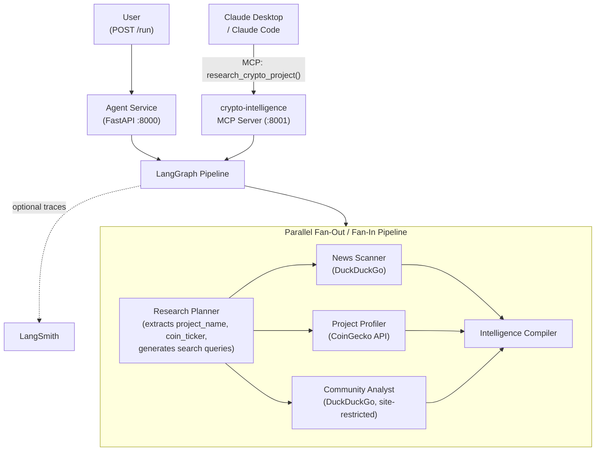

# Pattern 02: MCP Tool Integration

> Expose your agent pipeline as an MCP tool and run research agents in parallel -- one protocol, one tool call, full intelligence report.

`Pattern 02 of 9`. Expands Team 1 (Intelligence) from 3 agents to the full 5-agent lineup with a **parallel fan-out/fan-in** architecture and adds a second entry point: alongside `POST /run` (REST), the same pipeline is now accessible as an MCP tool. This is the Software 3.0 lesson -- the "UI" is Claude Desktop, not a bespoke chat widget.

Useful context:
- [Curriculum](../../docs/curriculum.md)
- [Vision & Roadmap](../../docs/vision.md)
- [Previous pattern: Orchestrator Pipeline](../01-orchestrator-pipeline/README.md)
- [Next pattern: Persistent Memory](../03-persistent-memory/README.md)

## Quick Start

```bash
# From the repository root
cp .env.example .env

# Required:
# - Azure OpenAI (AZURE_OPENAI_*) or Anthropic (ANTHROPIC_API_KEY + LLM_PROVIDER=anthropic)
#
# Optional but recommended:
# - LANGSMITH_API_KEY for hosted LangSmith traces

cd examples/02-mcp-tool-integration
docker compose up --build

# Test the REST entry point
curl http://localhost:8000/health
curl -X POST http://localhost:8000/run \
  -H "Content-Type: application/json" \
  -d '{"input": "Research the Arbitrum crypto project"}'
```

The MCP entry point is at `localhost:8001/sse` -- connect Claude Code, Cursor, or Claude Desktop (see [Connect Your MCP Client](#connect-your-mcp-client) below).

## What You Get Back

Both entry points (REST and MCP) run the same 5-agent pipeline and produce the same final intelligence report. The REST API returns the full intermediate artifact set for debugging, while the MCP tool returns the final `report` only because MCP tools should expose outcomes rather than internal pipeline state:

```json
{
  "report": "## Executive Summary\nArbitrum is a leading Layer 2...",
  "plan": "1. Recent news and partnerships\n2. Project fundamentals...",
  "news": "Key findings from web search: Arbitrum announced...",
  "profile": "Technology: Optimistic rollup on Ethereum. Market cap: $2.8B...",
  "community": "Community Health: Strong. GitHub: 847 commits last month..."
}
```

Via MCP, Claude Desktop receives the `report` field directly -- a complete analysis in one tool call. This asymmetry is intentional: REST is optimized for developer inspection, MCP is optimized for outcome-oriented tool use.

## At a Glance

| Item | Details |
|------|---------|
| Pattern role | Introduces MCP -- expose agent capabilities to AI clients |
| Team | Team 1: Intelligence (full 5-agent lineup) |
| Agents | Research Planner, News Scanner, Project Profiler, Community Analyst, Intelligence Compiler |
| Graph | Parallel fan-out/fan-in: planner → [news \| profiler \| community] → compiler |
| Entry points | REST: `POST /run` (:8000) · MCP: `research_crypto_project` tool (:8001) |
| MCP tool | `research_crypto_project(query)` -- runs the full pipeline |
| Data sources | News Scanner: DuckDuckGo · Project Profiler: CoinGecko API · Community Analyst: DuckDuckGo (site-restricted) |
| Runtime | Agent container (FastAPI) + MCP server container (same image, different command) |
| Input validation | `input` must be 3-500 characters (REST); `query` is free-text (MCP) |
| Timeout behavior | Both entry points execute synchronously with a 120s timeout boundary |
| Observability | `VERBOSE=true` logs to stderr; hosted LangSmith tracing when `LANGSMITH_API_KEY` is set |

## The Problem

Pattern 01 has two limitations. First, the pipeline is locked behind `POST /run` -- Claude Desktop, Cursor, and other AI clients can't call it. MCP fixes this by exposing the agent's capability as a standard protocol tool that any MCP client discovers automatically.

Second, the three research agents run sequentially even though they have zero data dependencies on each other. Parallel fan-out cuts wall-clock time by running them concurrently.

## Architecture



The MCP server and REST API share the same Docker image but run as **separate containers** -- one serves `POST /run` on `:8000`, the other serves the MCP SSE endpoint on `:8001`. This way a developer can use either entry point (or both) without any code changes. Both invoke the same compiled LangGraph, where three research nodes fan out in parallel after the planner and fan in at the compiler.

## Key Concepts

- **Outcome-oriented MCP tool** -- expose `research_crypto_project` (the full pipeline), not raw API wrappers like `get_coin_price`
- **Parallel fan-out/fan-in** -- three research nodes run concurrently via LangGraph `add_edge`; compiler waits for all three
- **Data source ownership** -- each node owns one external source (DuckDuckGo or CoinGecko), no duplication
- **Graceful degradation** -- CoinGecko retry with backoff; search and LLM failures produce partial output, not crashes
- **Synchronous execution boundary** -- REST and MCP both wait for the full pipeline result and fail fast after 120 seconds instead of hanging indefinitely

## Implementation Walkthrough

### MCP Server

The full implementation is in [`src/mcp_servers/crypto_intelligence.py`](src/mcp_servers/crypto_intelligence.py) -- ~30 lines. It builds the graph once and wraps it as a single MCP tool:

```python
mcp = FastMCP("crypto-intelligence", host="0.0.0.0", port=8000)
_graph = build_graph()

@mcp.tool()
async def research_crypto_project(query: str) -> str:
    result = await _graph.ainvoke({"input": query})
    return result.get("report", "")
```

### Parallel Graph

The graph uses LangGraph's native fan-out: after `research_planner`, three edges fire simultaneously to `news_scanner`, `project_profiler`, and `community_analyst`. The compiler waits for all three via fan-in. See [`src/agents/graph.py`](src/agents/graph.py) for the wiring and the [LangGraph branching docs](https://langchain-ai.github.io/langgraph/how-tos/branching/) for the pattern.

The planner extracts `project_name` and `coin_ticker` via LLM and generates search queries so downstream nodes don't pass raw user input to external APIs. See [`src/agents/research_planner.py`](src/agents/research_planner.py).

### Docker Compose

Both containers use the same image -- only the command differs. See [`docker-compose.yml`](docker-compose.yml):

```yaml
services:
  crypto-intelligence-mcp:
    command: ["uvicorn", "src.mcp_servers.crypto_intelligence:app", ...]
    ports: ["8001:8000"]

  agent:
    # default CMD: uvicorn src.app:app
    ports: ["8000:8000"]
```

## Connect Your MCP Client

With `docker compose up` running, connect from your tool of choice:

**Claude Code:**
```bash
claude mcp add --transport sse crypto-intelligence http://localhost:8001/sse
```

**Cursor** -- add to your project's `.cursor/mcp.json`:
```json
{
  "mcpServers": {
    "crypto-intelligence": {
      "url": "http://localhost:8001/sse"
    }
  }
}
```

**Claude Desktop** -- add to `%APPDATA%\Claude\claude_desktop_config.json` (macOS: `~/Library/Application Support/Claude/claude_desktop_config.json`):
```json
{
  "mcpServers": {
    "crypto-intelligence": {
      "url": "http://localhost:8001/sse"
    }
  }
}
```

Then ask: *"Research the Solana crypto project"*.

## Local Development

```bash
# From the repository root
uv sync --all-packages
uv run python scripts/testing/run_test_suite.py
uv run python scripts/linting/run_mypy.py
```

## Exercises

1. **Add a lightweight MCP tool**: Expose `get_crypto_price(project_name)` that skips the full pipeline and returns just the current price via CoinGecko.
2. **Add a fourth parallel branch**: Create a `tokenomics_analyst` node that fans out alongside the other three research nodes.

## Trade-offs

| Advantage | Limitation |
|-----------|-----------|
| Any MCP client gets the full agent capability | MCP server runs the full pipeline per call (cost/latency) |
| Parallel execution cuts wall-clock time vs. sequential | Three concurrent DuckDuckGo/CoinGecko calls may hit rate limits faster |
| Claude Desktop is the "UI" -- no custom frontend | Streaming partial results is not supported (Pattern 06 adds this) |
| Same graph, two entry points -- no code duplication | Two containers for the same image |
| REST exposes intermediate artifacts for debugging; MCP exposes only the final report | Entry points are intentionally asymmetric, so clients see different response shapes |
| Internal data sources are hidden from clients | CoinGecko rate limits apply (30 req/min free tier; retry with backoff mitigates) |
| Timeout prevents hung requests from running forever | Background jobs / `202 Accepted` polling are not implemented in this pattern to keep focus on MCP integration |

Both entry points currently execute the pipeline synchronously. In a production system with longer-running research, a background-task or job-queue design such as `POST /run -> 202 Accepted -> GET /tasks/{id}` would be reasonable, but that extra lifecycle machinery would distract from the MCP lesson here.

This last limitation -- every request starts from scratch -- is the reason [Pattern 03](../03-persistent-memory/README.md) exists.

## Further Reading

- [FastMCP (MCP Python SDK)](https://github.com/modelcontextprotocol/python-sdk) -- the `FastMCP` class used in this pattern
- [MCP Server Design Best Practices](https://www.philschmid.de/mcp-best-practices) -- expose outcomes, not raw APIs
- [LangGraph: Parallel Branch Execution](https://langchain-ai.github.io/langgraph/how-tos/branching/) -- the fan-out/fan-in pattern used in this graph
- [MCP Specification](https://modelcontextprotocol.io/)
