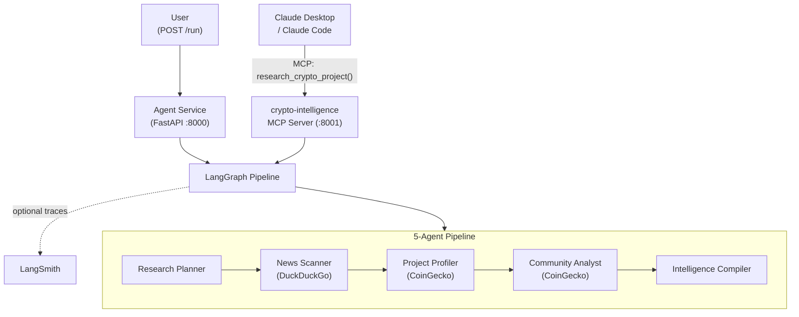

# Pattern 02: MCP Tool Integration

> Expose your agent pipeline as an MCP server so Claude Desktop, Cursor, or Claude Code can call `research_crypto_project` and get a full intelligence report -- one tool, one protocol, no custom UI.

`Pattern 02 of 9`. Expands Team 1 (Intelligence) from 3 agents to the full 5-agent lineup and adds a second entry point: alongside `POST /run` (REST), the same pipeline is now accessible as an MCP tool. This is the Software 3.0 lesson -- the "UI" is Claude Desktop, not a bespoke chat widget.

Useful context:
- [Curriculum](../../docs/curriculum.md)
- [Vision & Roadmap](../../docs/vision.md)
- [Previous pattern: Orchestrator Pipeline](../01-orchestrator-pipeline/README.md)
- [Next pattern: Persistent Memory](../03-persistent-memory/README.md)

## Quick Start

```bash
# From the repository root
cp .env.example .env

# Required:
# - Azure OpenAI (AZURE_OPENAI_*) or Anthropic (ANTHROPIC_API_KEY + LLM_PROVIDER=anthropic)
#
# Optional but recommended:
# - LANGSMITH_API_KEY for hosted LangSmith traces

cd examples/02-mcp-tool-integration
docker compose up --build

# Test the REST entry point
curl http://localhost:8000/health
curl -X POST http://localhost:8000/run \
  -H "Content-Type: application/json" \
  -d '{"input": "Research the Arbitrum crypto project"}'
```

The MCP entry point is at `localhost:8001/sse` -- connect Claude Desktop or Claude Code (see [Claude Desktop Integration](#claude-desktop-integration) below).

## What You Get Back

Both entry points (REST and MCP) run the same 5-agent pipeline and return the same intelligence report:

```json
{
  "report": "## Executive Summary\nArbitrum is a leading Layer 2...",
  "plan": "1. Recent news and partnerships\n2. Project fundamentals...",
  "news": "Key findings from web search: Arbitrum announced...",
  "profile": "Technology: Optimistic rollup on Ethereum. Market cap: $2.8B...",
  "community": "Community Health: Strong. GitHub: 847 commits last month..."
}
```

Via MCP, Claude Desktop receives the `report` field directly -- a complete analysis in one tool call.

## At a Glance

| Item | Details |
|------|---------|
| Pattern role | Introduces MCP -- expose agent capabilities to AI clients |
| Team | Team 1: Intelligence (full 5-agent lineup) |
| Agents | Research Planner, News Scanner, Project Profiler, Community Analyst, Intelligence Compiler |
| Entry points | REST: `POST /run` (:8000) · MCP: `research_crypto_project` tool (:8001) |
| MCP tool | `research_crypto_project(project_name)` -- runs the full pipeline |
| Data sources | DuckDuckGo (web search), CoinGecko free API (project data, prices) |
| Runtime | Agent container (FastAPI) + MCP server container (same image, different command) |
| Input validation | `input` must be 3-500 characters (REST); `project_name` is free-text (MCP) |
| Observability | `VERBOSE=true` logs to stderr; hosted LangSmith tracing when `LANGSMITH_API_KEY` is set |

## The Problem

In Pattern 01, the pipeline is locked behind `POST /run` -- a REST endpoint. This is Software 2.0 thinking: you build a custom client, you call a custom API.

Claude Desktop can't use it. Cursor can't use it. Another AI agent can't use it. The only way to trigger the pipeline is a bespoke HTTP call.

MCP changes the interface:

| Aspect | Pattern 01 (REST only) | Pattern 02 (REST + MCP) |
|--------|----------------------|------------------------|
| Claude Desktop | Can't access | Calls `research_crypto_project` via MCP |
| Custom client | `curl POST /run` | Still works |
| What's exposed | REST endpoint | Agent **capability** as a protocol tool |
| Discovery | Read the docs, know the URL | MCP client discovers tools automatically |

## Architecture



Two containers, one graph. The MCP server and the FastAPI agent share the same Docker image -- only the `command` differs.

## Key Concepts

- **Expose capability, not plumbing**: the MCP tool is `research_crypto_project`, not `get_coin_price`. The internal orchestration is hidden.
- **Two entry points, one graph**: REST and MCP both call `build_graph().ainvoke()`. Same result, different protocols.
- **MCP server with `FastMCP`**: a few lines to wrap the pipeline as a discoverable tool.
- **Data sources are internal**: agents call CoinGecko and DuckDuckGo directly (httpx, langchain). MCP is for the external interface, not internal data fetching.
- **Graceful degradation**: CoinGecko failures, search failures, and LLM failures produce partial output, not crashes.

## Implementation Walkthrough

### Step 1: Build the MCP server that exposes the agent pipeline

The entire MCP server is small -- it builds the graph and exposes one tool:

```python
from mcp.server.fastmcp import FastMCP
from src.agents.graph import build_graph

mcp = FastMCP("crypto-intelligence", host="0.0.0.0", port=8000)
_graph = build_graph()

@mcp.tool()
async def research_crypto_project(project_name: str) -> str:
    """Research a cryptocurrency project and produce a structured intelligence report."""
    result = await _graph.ainvoke({"input": f"Research the {project_name} crypto project"})
    return result.get("report", "")
```

Claude Desktop sees one tool: `research_crypto_project(project_name)`. It doesn't see or care about the 5 agents, CoinGecko, or DuckDuckGo behind it.

### Step 2: Agents call data sources directly

No MCP wrappers around APIs. The Project Profiler calls CoinGecko directly:

```python
from src.coingecko import search_coins, get_coin_info, get_coin_price

async def project_profiler_node(state: AgentState) -> dict[str, str]:
    search_results = await search_coins(query)
    coin_info = await get_coin_info(coin_id)
    coin_price = await get_coin_price(coin_id)
    # LLM analyzes the data
    return {"profile": str(response.content)}
```

### Step 3: Docker Compose with two entry points

Both containers use the same image -- only the command differs:

```yaml
services:
  crypto-intelligence-mcp:
    command: ["uvicorn", "src.mcp_servers.crypto_intelligence:app", ...]
    ports: ["8001:8000"]

  agent:
    # default CMD: uvicorn src.app:app
    ports: ["8000:8000"]
```

### Claude Desktop Integration

With Docker running, add this to `%APPDATA%\Claude\claude_desktop_config.json`:

```json
{
  "mcpServers": {
    "crypto-intelligence": {
      "url": "http://localhost:8001/sse"
    }
  }
}
```

Restart Claude Desktop. Ask: *"Research the Solana crypto project"*. Claude calls `research_crypto_project("Solana")` and gets a complete intelligence report.

### Claude Code Integration

```bash
claude mcp add --transport sse crypto-intelligence http://localhost:8001/sse
```

## What You Should See

With `VERBOSE=true`, container logs show the pipeline executing (same output whether triggered via REST or MCP):

```text
[14:32:01.234] [System] FastAPI application started
[14:32:05.234] [ResearchPlanner] Planning research for: Research the Arbitrum crypto project
[14:32:07.891] [NewsScanner] Searching for: Research the Arbitrum crypto project
[14:32:10.445] [NewsScanner] Got 8 search results
[14:32:13.234] [NewsScanner] Analysis complete (623 chars)
[14:32:13.235] [ProjectProfiler] Profiling: Research the Arbitrum crypto project
[14:32:13.567] [CoinGecko] search_coins('Arbitrum') -> 5 results
[14:32:14.123] [CoinGecko] get_coin_info('arbitrum') -> Arbitrum
[14:32:14.456] [CoinGecko] get_coin_price('arbitrum') -> $1.23
[14:32:17.890] [CommunityAnalyst] Got community/developer data
[14:32:21.234] [IntelligenceCompiler] Report generated (1247 chars)
```

## Verification

```bash
# REST entry point
curl http://localhost:8000/health
curl -X POST http://localhost:8000/run \
  -H "Content-Type: application/json" \
  -d '{"input": "Research the Solana crypto project"}'

# Validation (expect 422)
curl -X POST http://localhost:8000/run \
  -H "Content-Type: application/json" \
  -d '{"input": "ab"}'
```

For MCP: connect Claude Desktop or Claude Code (see above), then ask about any crypto project.

## Local Development

```bash
# From the repository root
uv sync --all-packages
uv run python scripts/testing/run_test_suite.py
uv run python scripts/linting/run_mypy.py
```

## Exercises

1. **Add a second MCP tool**: Expose `get_crypto_price(project_name)` as a lightweight MCP tool that skips the full pipeline and returns just the current price via CoinGecko.
2. **Use the official CoinGecko MCP**: Replace direct httpx calls with the official `@coingecko/coingecko-mcp` server (requires a free CoinGecko API key). Observe how the MCP server's `research_crypto_project` tool doesn't change -- internal data access is hidden from MCP clients.
3. **Test with Claude Desktop**: Connect to the MCP server and research different crypto projects. Compare the output with `POST /run`.

## Trade-offs

| Advantage | Limitation |
|-----------|-----------|
| Any MCP client gets the full agent capability | MCP server runs the full pipeline per call (cost/latency) |
| Claude Desktop is the "UI" -- no custom frontend | Streaming partial results is not supported (Pattern 06 adds this) |
| Same graph, two entry points -- no code duplication | Two containers for the same image |
| Internal data sources are hidden from clients | CoinGecko rate limits apply (30 req/min free tier) |

This last limitation -- every request starts from scratch -- is the reason [Pattern 03](../03-persistent-memory/README.md) exists.

## Further Reading

- [MCP Specification](https://modelcontextprotocol.io/)
- [MCP Server Design Best Practices](https://www.philschmid.de/mcp-best-practices) -- expose outcomes, not raw APIs
- [MCP Python SDK](https://github.com/modelcontextprotocol/python-sdk)
- [CoinGecko Free API](https://docs.coingecko.com/reference/introduction)
- [CoinGecko Official MCP](https://www.npmjs.com/package/@coingecko/coingecko-mcp) -- alternative to direct API calls
