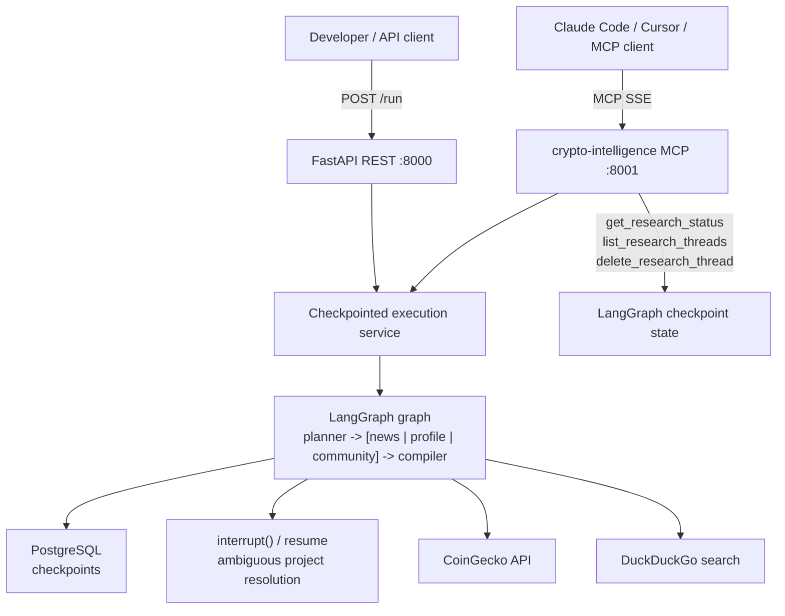

# Pattern 03: Checkpoint Recovery and Resilience

> Recover long-running agent workflows from the last successful checkpoint, and pause safely for human clarification when the planner is unsure which crypto project the user meant.

`Pattern 03 of 9`. Keeps Team 1's five-agent intelligence pipeline from [Pattern 02](../02-mcp-tool-integration/README.md), but changes the operational model: the graph is now checkpointed in PostgreSQL, failures can be retried with the same `thread_id`, and ambiguous CoinGecko matches trigger `interrupt()` instead of silently choosing the wrong project.

Thread inspection is exposed as MCP tools, not REST endpoints -- because the consumer is an AI agent (Claude, Cursor), not a human clicking a dashboard.

Useful context:
- [Curriculum](../../docs/curriculum.md)
- [Vision & Roadmap](../../docs/vision.md)
- [Previous pattern: MCP Tool Integration](../02-mcp-tool-integration/README.md)

## Quick Start

```bash
# From the repository root
cp .env.example .env

# Required:
# - Azure OpenAI (AZURE_OPENAI_*) or Anthropic (ANTHROPIC_API_KEY + LLM_PROVIDER=anthropic)
#
# Optional but recommended:
# - LANGSMITH_API_KEY for hosted LangSmith traces

cd examples/03-checkpoint-recovery
docker compose up --build

# Health
curl http://localhost:8000/health

# Start a checkpointed run
curl -X POST http://localhost:8000/run \
  -H "Content-Type: application/json" \
  -d "{\"input\": \"Research the Arbitrum crypto project\", \"thread_id\": \"arb-demo-thread\"}"

# Resume an interrupted run after the planner asks you to choose a CoinGecko project
curl -X POST http://localhost:8000/run/resume \
  -H "Content-Type: application/json" \
  -d "{\"thread_id\": \"arb-demo-thread\", \"selected_coin_id\": \"arbitrum\"}"
```

The example depends on the repo-root `.env` file and starts three containers: PostgreSQL, the REST API on `:8000`, and the MCP server on `:8001`.

If you prefer prebuilt REST requests, use [`endpoints.http`](endpoints.http).

## What You Get Back

`POST /run` returns one of two outcomes.

Completed run:

```json
{
  "status": "completed",
  "thread_id": "arb-demo-thread",
  "report": "## Executive Summary\nArbitrum is a leading Layer 2...",
  "plan": "1. Recent news and partnerships\n2. Project fundamentals...",
  "news": "Key findings from web search...",
  "profile": "Technology: Optimistic rollup on Ethereum...",
  "community": "Community Health: Strong...",
  "project_name": "Arbitrum",
  "coin_ticker": "ARB",
  "coin_id": "arbitrum"
}
```

Interrupted run:

```json
{
  "status": "interrupted",
  "thread_id": "mercury-demo-thread",
  "interrupt_type": "ambiguous_project",
  "message": "Multiple CoinGecko matches found for Mercury. Choose the correct project to continue.",
  "project_name": "Mercury",
  "coin_ticker": "",
  "matches": [
    {
      "coin_id": "mercury",
      "name": "Mercury",
      "symbol": "MER",
      "market_cap_rank": 999
    }
  ]
}
```

For failure recovery, call `POST /run` again with the same `thread_id`. For human-in-the-loop interrupts, call `POST /run/resume`.

## At a Glance

| Item | Details |
|------|---------|
| Pattern role | Introduces durable execution and human checkpoints |
| Team | Team 1: Intelligence |
| Agents | Research Planner, News Scanner, Project Profiler, Community Analyst, Intelligence Compiler |
| Graph | Same fan-out/fan-in graph as Pattern 02 |
| New runtime behavior | PostgreSQL-backed checkpoints, retry-after-failure, interrupt/resume |
| REST endpoints | `POST /run`, `POST /run/resume` (minimal -- thread inspection is MCP) |
| MCP tools | `research_crypto_project`, `get_research_status`, `list_research_threads`, `delete_research_thread` |
| Storage | PostgreSQL for LangGraph checkpoints (no separate thread metadata table) |
| External data | CoinGecko, DuckDuckGo |
| Observability | `VERBOSE=true` logs and LangSmith metadata tagged with `thread_id` |

## The Problem

Pattern 02 has a realistic failure surface: three external API calls, multiple LLM calls, and a parallel graph. If `project_profiler` fails after `news_scanner` and `community_analyst` succeed, the whole workflow has to be replayed unless the graph is checkpointed.

There is also a correctness problem. If the planner extracts a project name like "Mercury", blindly taking the first CoinGecko search result is risky. The graph should pause and ask the human to choose the intended project instead of continuing with the wrong coin.

## Architecture



The graph topology is intentionally unchanged from Pattern 02 because the change here is operational, not structural. The new moving parts sit around the graph: a durable checkpointer and a transport layer that knows the difference between retrying a failed run and resuming an interrupted one. Thread inspection is exposed as MCP tools that derive status from LangGraph's checkpoint state directly -- no separate status table.

## Key Concepts

- **Checkpointing is resilience, not memory** -- the same `thread_id` resumes a failed workflow, but it does not create cross-session knowledge.
- **Retry and resume are different** -- retry a failed run with `POST /run`; resume a human pause with `POST /run/resume`.
- **Interrupts are graph behavior** -- ambiguous CoinGecko matches become `interrupt()` calls instead of a hidden best guess.
- **Thread status is derived from checkpoints** -- the MCP tools inspect LangGraph state instead of maintaining a parallel status table.

## Implementation Walkthrough

1. Build the durable runtime in [`src/runtime.py`](src/runtime.py). It opens the PostgreSQL pool, initializes the LangGraph checkpointer, and compiles the graph once so both transports share the same checkpoint-backed execution engine.
2. Keep run semantics in [`src/service.py`](src/service.py). That module decides whether a call is a fresh run, a retry of a failed thread, or a resume of a human interruption by inspecting checkpoint state rather than maintaining a separate thread table.
3. Keep the human-in-the-loop logic in [`src/agents/research_planner.py`](src/agents/research_planner.py). Pattern 03 splits planning, project verification, and project selection so the graph can pause safely when CoinGecko returns multiple plausible matches.
4. Expose the graph through two transport boundaries: REST in [`src/app.py`](src/app.py) and MCP in [`src/mcp_servers/crypto_intelligence.py`](src/mcp_servers/crypto_intelligence.py). REST stays minimal with `/health`, `POST /run`, and `POST /run/resume`, while MCP becomes the richer agent-facing interface for thread inspection.

The MCP server exposes four tools:

| Tool | Purpose |
|------|---------|
| `research_crypto_project` | Run or resume a crypto research pipeline |
| `get_research_status` | Inspect a thread's checkpoint state (completed / interrupted / resumable) |
| `list_research_threads` | List all known threads with their derived status |
| `delete_research_thread` | Delete a thread and its checkpoint data |

## Connect Your MCP Client

The MCP server is exposed at `http://localhost:8001/sse`.

With `docker compose up` running, connect from your tool of choice:

**Claude Code:**
```bash
claude mcp add --transport sse crypto-intelligence http://localhost:8001/sse
```

**Cursor** -- add to your project's `.cursor/mcp.json`:
```json
{
  "mcpServers": {
    "crypto-intelligence": {
      "url": "http://localhost:8001/sse"
    }
  }
}
```

**Claude Desktop** -- add to `%APPDATA%\Claude\claude_desktop_config.json` (macOS: `~/Library/Application Support/Claude/claude_desktop_config.json`):
```json
{
  "mcpServers": {
    "crypto-intelligence": {
      "url": "http://localhost:8001/sse"
    }
  }
}
```

Once connected, the tool surface is:

```text
research_crypto_project(query, thread_id?, selected_coin_id?)
get_research_status(thread_id)
list_research_threads()
delete_research_thread(thread_id)
```

Typical flow:

1. Call `research_crypto_project(query="Research Mercury", thread_id="mercury-demo-thread")`.
2. If the planner interrupts, the tool returns a message listing the candidate CoinGecko IDs.
3. Call `research_crypto_project(query="Research Mercury", thread_id="mercury-demo-thread", selected_coin_id="mercury")`.
4. Optionally call `get_research_status("mercury-demo-thread")` to inspect the thread later.

## Local Development

```bash
# Install workspace dependencies
uv sync --all-packages

# Run just this example's tests
uv run pytest examples/03-checkpoint-recovery/tests

# Run repo checks
uv run python scripts/testing/run_test_suite.py
uv run ruff check .
uv run ruff format --check .
uv run python scripts/linting/run_mypy.py
```

## What You Have Learned

- How to add durable execution to an existing LangGraph pipeline without changing its core topology.
- How to model retry-after-failure and resume-after-interrupt as separate execution paths around one shared graph.
- How to use `interrupt()` and `Command(resume=...)` to make ambiguous external matches explicit and safe.
- How to expose checkpoint inspection as MCP tools instead of adding REST CRUD around workflow state.

**Next:** [Pattern 04: Agent Memory and Knowledge](../04-agent-memory/README.md) builds on this durable runtime by adding real cross-session memory so the system remembers users, projects, and prior research beyond a single thread.

If this project helps you, consider giving it a [star on GitHub](https://github.com/ksopyla/agent-patterns-lab).

## Further Reading

- [LangGraph persistence](https://docs.langchain.com/oss/python/langgraph/persistence)
- [LangGraph interrupts](https://docs.langchain.com/oss/python/langgraph/interrupts)
- [PostgreSQL checkpointers in LangGraph](https://docs.langchain.com/oss/python/langgraph/add-memory)
